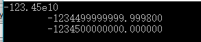

# Ch4 函数与程序结构

###4.1函数的基本知识

将输入中包含特定“模式”或字符串的各行打印出来

~~~c
# include <stdio.h>
# define MAXLINE 1000

int getline(char line[], int max);
int strindex(char source[], char searchfor[]);

char pattern[] = "ould"; // 待查的模式

// 找出所有与模式匹配的行
main(){
    char line[MAXLINE];
    int found = 0;

    while(getline(line, MAXLINE) > 0){
        if(strindex(line, pattern) >= 0){
            printf("%s", line);
            found++;
        }
    }
    return found; 
}

// 将行保存在s中并返回改行的长度
int getline(char s[], int lim){
    int c, i;
    i = 0;
    while(--lim>0 && (c=getchar())!=EOF && c!='\n')
        s[i++] = c;
    if(c == '\n')
        s[i++] = c;
    s[i] = '\0';
    return i;
}

// 返回t在s中的位置若未找到返回-1
int strindex(char s[], char t[]){
    int i, j, k;
    for(i=0; s[i]!='\0'; i++){
        for(j=i, k=0; t[k]!='\0' && s[j]==t[k]; j++, k++);
        if(k > 0 && t[k] == '\0')
            return i;
    }
    return -1;
}
~~~

*注*

该主函数中main返回了一个状态，即匹配的数目，该返回值可以在调用该程序的环境中使用

#### 4-1 编写strindex(s,t)返回字符串t在s中最右边出现的位置，如s中不含t则返回-1

~~~c
# include <stdio.h>
# define MAXLINE 1000

int getline(char line[], int max);
int strindex(char source[], char searchfor[]);

char pattern[] = "as"; // 待查的模式

// 找出所有与模式匹配的行
main(){
    char line[MAXLINE];
    int found = 0;

    while(getline(line, MAXLINE) > 0){
        printf("%d\n", strindex(line, pattern));
    }
}

// 将行保存在s中并返回改行的长度
int getline(char s[], int lim){
    int c, i;
    i = 0;
    while(--lim>0 && (c=getchar())!=EOF && c!='\n')
        s[i++] = c;
    if(c == '\n')
        s[i++] = c;
    s[i] = '\0';
    return i;
}

// 自己写的版本
int strindex(char s[], char t[]){
    int i, j, k, start;
    start = -1;
    for(i=0; s[i]!='\0'; i++){
        for(j=i, k=0; s[j]==t[k]; j++, k++){
            if(t[k+1] == '\0')
                start = i+1;
        }
    }
    return start;
}

// 教材
int strindex(char s[], char t[]){
    int i, j, k, start;
    start = -1;
    for(i=0; s[i]!='\0'; i++){
        for(j=i, k=0; t[k]!='\0' && s[j]==t[k]; j++, k++);
        if(k>0 && t[k] == '\0')
            start = i;
    }
    return start;
}

// 教材 效率更高
int strindex(char s[], char t[]){
    int i, j, k;
    
    for(i=strlen(s)-strlen(t); i>=0; i--){
        for(j=i, k=0; t[k] != '\0' && s[i]==t[k]; j++, k++);
        if(k>0 && t[k]!='\0')
            return i;
    }
    return -1;
}
~~~

### 4.2返回非整型的函数

把字符串s转换为相应的双精度浮点数

~~~
# include <stdio.h>
# include <ctype.h>
// 把字符串s转换为相应的双精度浮点数
double atof(char s[]){
    double val, power;
    int i, sign;

    for(i=0; isspace(s[i]); i++);
    sign = (s[i] == '-') ? -1 : 1;
    if(s[i] == '+' || s[i] == '-')
        i++;
    for(val = 0.0; isdigit(s[i]); i++)
        val = 10.0 * val + (s[i] - '0');
    if(s[i] == '.')
        i++;
    for(power = 1.0; isdigit(s[i]); i++){
        val = 10.0 * val + (s[i] - '0');
        power *= 10.0;
    }
    return sign * val / power;
}
~~~

*注意*

在字符型转整型浮点型时``s[i] - '0'``

在整型浮点型转字符型时``s[i] + '0'``

***

在每行中读取一个数（数的前面可能有正负号）并对他们求和，在每次输入完成后把这些数的累计总和打印

~~~c
main(){
    double sum, atof(char[]);
    char line[MAXLINE];
    int getline(char line[], int max);

    sum = 0;
    while((getline(line, MAXLINE)) > 0)
        printf("\t%g\n", sum += atof(line));
    return 0;
}
~~~

*注*

%g用来输出实数，它根据数值的大小，自动选f格式或e格式（选择输出时占宽度较小的一种），且不输出无意义的0。即%g是根据结果自动选择科学记数法还是一般的小数记数法

printf("%g\n", 0.00001234);
printf("%g\n", 0.0001234);
printf("%.2g\n", 123.45);
printf("%.2g\n", 23.45);

上面四句输出结果为:
1.234e-05
0.0001234
1.2e+02
23
对于指数小于-4或者大于给定精度的数值,按照%e的控制输出,否则按照%f的控制输出

%g至多保留6位有效数字

#### *4-2 对atof函数进行扩充其可以处理123.45e-6的科学表示法，其中，浮点数后面可能会紧跟一个e或E以及一个指数（可能有正负号）

~~~c
# include <stdio.h>
# include <ctype.h>
# define MAXLINE 100
// 自己写的版本
double atof(char s[]){
    int i, sign1, sign2;
    double power;
    double val = 0.0;
    int val2 = 0;
    for(i=0; isspace(s[i]); i++);
    sign1 = (s[i] == '-') ? -1 : 1;
    if(s[i] == '+' || s[i] == '-')
        i++;
    for(; isdigit(s[i]); i++){
        val = 10.0 * val + (s[i] - '0');
    }
    if(s[i] == '.')
        i++;
    for(power=1.0; isdigit(s[i]); i++){
        val = 10.0 * val + (s[i] - '0');
        power *= 10.0;
    }

    if(s[i] == 'e' || s[i] == 'E')
        i++;
    sign2 = (s[i] == '-') ? -1 : 1;
    if(s[i] == '+' || s[i] == '-')
        i++;
    for(; isdigit(s[i]); i++)
        val2 = 10 * val2 + (s[i] - '0');
    if(sign2 == 1)
        while(val2){
            power /= 10.0;
            val2--;
        }
    else if(sign2 == -1)
        while(val2){
            power *= 10.0;
            val2--;
        }
    return sign1 * val / power;
}

// 教材
double atof2(char s[]){
    double val, power;
    int exp, i, sign;

    for(i=0; isspace(s[i]); i++);
    sign = (s[i] == '-') ? -1 : 1;
    if(s[i] == '+' || s[i] == '-')
        i++;
    for(val=0.0; isdigit(s[i]); i++)
        val = 10.0 * val + (s[i] - '0');
    if(s[i] == '.')
        i++;
    for(power=1.0; isdigit(s[i]); i++){
        val = 10.0 * val + (s[i] - '0');
        power *= 10.0;
    }
    val = sign * val / power;

    if(s[i] == 'e' || s[i] == 'E'){
        sign = (s[++i] == '-') ? -1 : 1;
        if(s[i] == '-' || s[i] == '+')
            i++;
        for(exp=0; isdigit(s[i]); i++)
            exp = 10 * exp + (s[i] - '0');
        if(sign == 1)
            while(exp-->0)
                val *= 10;
        else
            while(exp-->0)
                val /= 10;
    }
    return val;
}

main(){
    double atof(char[]),atof2(char[]);
    char line[MAXLINE] = "-123.45e10";
    printf("\t%lf\n", atof(line));
    printf("\t%lf\n", atof2(line));
    return 0;
}
~~~

*注*

自己写的版本出现丢失精度的情况，是因为用**power/10的val2次方**时会出现小数，无法用二进制精确的表示出来，在大多数机器上，**0.1的二进制表示法都要比0.1稍微小一点**，用**10.0*0.1并不能精确地得到1.0**

因此**连续地除以10**比**连续地乘以0.1**更精确

因此更提倡教材的版本，即将指数部分单独出来进行计算

### 4.3外部变量

逆波兰式计算器

~~~c
# include <stdio.h>
# include <stdlib.h> // 为使用atof()函数

# define MAXOP 100 // 操作数或运算符的最大长度
# define NUMBER '0' // 标识找到一个数

int getop(char []);
void push(double);
double pop(void);

// 逆波兰式计算器
main(){
    int type;
    double op2;
    char s[MAXOP];

    while((type = getop(s)) != EOF){
        switch(type){
        case NUMBER:
            push(atof(s));
            break;
        case '+':
            push(pop() + pop());
            break;
        case '*':
            push(pop() * pop());
            break;
        case '-':
            op2 = pop();
            push(pop() - op2);
            break;
        case '/':
            op2 = pop();
            if(op2 != 0.0)
                push(pop() / op2);
            else
                printf("error: zero divisor\n");
            break;
        case '\n':
            printf("\t%.8g\n", pop());
            break;
        default:
            printf("error: unknown command %s\n", s);
            break;
        }
    }
    return 0;
}

/***************************************************************************/

# define MAXVAL 100 // 栈val的最大深度

int sp = 0; // 下一个空闲栈位置
double val[MAXVAL]; // 值栈

// 把f压入值栈中
void push(double f){
    if(sp < MAXVAL)
        val[sp++] = f;
    else
        printf("error: stack full, can't push %g\n",f);
}

// 弹出并返回栈顶的值
double pop(){
    if(sp > 0)
        return val[--sp];
    else{
        printf("error: stack empty\n");
        return 0.0;
    }
}

/***************************************************************************/
# include <ctype.h>
int getch(void); // 读入下一个待处理的字符
void ungetch(int); // 把字符放回到输入中

// 获取下一个运算符或数值操作数
int getop(char s[]){
    int i, c;
    while((s[0] = c = getch()) == ' ' || c == '\t'); // 看下面注3

    s[1] = '\0';
    if(!isdigit(c) && c != '.')
        return c; // 不是数
    i = 0;
    if(isdigit(c)) // 收集整数部分  看下面注3
        while(isdigit(s[++i] = c = getch()));
    if(c == '.') // 收集小数部分
        while(isdigit(s[++i] = c = getch()));
    s[i] = '\0';
    if(c != EOF)
        ungetch(c);
    return NUMBER;
}

/***************************************************************************/
# define BUFSIZE 100

char buf[BUFSIZE]; // 用于ungetch()函数的缓冲区
int bufp = 0; // buf中下一个空闲位置

// 取一个字符（可能是压回的字符）
int getch(void){
    return (bufp > 0) ? buf[--bufp] : getchar();
}

// 把字符压回输入中
void ungetch(int c){
    if(bufp >= BUFSIZE)
        printf("ungetch: too many characters\n");
    else
        buf[bufp++] = c;
}
~~~

*注*

1. main函数不需要了解控制栈的变量信息，只进行压入与弹出操作，因此可以把栈以及相关信息放入外部变量中，并只供push和pop函数访问，而不被main函数访问
2. getch和ungetch函数用于超前多读入一些输入用来判断已经读入的输入是否足够
3. 如输入**12.3**时第一次满足`` while((s[0] = c = getch()) == ' ' || c == '\t')``中的不等式时跳出就**已将第一个不等于‘ ’或‘\t’的值付给了s[0]** 
4. ``s[++i] = c = getch()``的执行顺序
   1. i++
   2. c = getch()
   3. s[i] = c

### *求模运算和求余运算区别

其实取模和取余在目标上是一致的，但是因为语言对取余和取模上定义的不同，导致得到的结果不同。

对取余和取模定义不同的语言中，两者的不同点只有一个

**取余运算在计算商值向0方向舍弃小数位**

**取模运算在计算商值向负无穷方向舍弃小数位**（尽可能让商小的原则**）

从上面的区别可以总结出，取余（rem）和取模（mod）在被除数、除数同号时，结果是等同的，**异号时会有区别，所以要特别注意异号的情况**。

下面来看一些例子

1. 取模

   7 mod 4 = 3（商 = 1 或 2，1<2，取商=1）

   -7 mod 4 = 1（商 = -1 或 -2，-2<-1，取商=-2）

   7 mod -4 = -1（商 = -1或-2，-2<-1，取商=-2）

   -7 mod -4 = -3（商 = 1或2，1<2，取商=1）

2. 取余

   7 rem 4 = 3 

   -7 rem 4 = -3

另外各个环境下%运算符的含义不同，比如c/c++，java 为取余，而python则为取模。

#### *4-3 在计算器框架程序中加入取模（%）运算，并注意考虑负数的情况

~~~c
# include <stdio.h>
# include <stdlib.h> // 为使用atof()函数
# include <math.h>

# define MAXOP 100 // 操作数或运算符的最大长度
# define NUMBER '0' // 标识找到一个数

int getop(char []);
void push(double);
double pop(void);

// 逆波兰式计算器
main(){
    int type;
    double op2;
    char s[MAXOP];

    while((type = getop(s)) != EOF){
        //printf("%s\n",s);
        switch(type){
        case NUMBER:
            push(atof(s));
            break;
        case '+':
            push(pop() + pop());
            break;
        case '*':
            push(pop() * pop());
            break;
        case '-':
            op2 = pop();
            push(pop() - op2);
            break;
        case '/':
            op2 = pop();
            if(op2 != 0.0)
                push(pop() / op2);
            else
                printf("error: zero divisor\n");
            break;
        case '%':
            op2 = pop();
            if(op2 != 0.0)
                push((((int)pop() % (int)op2) + (int)op2) % (int)op2);
            break;
        case '\n':
            printf("\t%.8g\n", pop());
            break;
        default:
            printf("error: unknown command %s\n", s);
            break;
        }
    }
    return 0;
}

/***************************************************************************/

# define MAXVAL 100 // 栈val的最大深度

int sp = 0; // 下一个空闲栈位置
double val[MAXVAL]; // 值栈

// 把f压入值栈中
void push(double f){
    if(sp < MAXVAL)
        val[sp++] = f;
    else
        printf("error: stack full, can't push %g\n",f);
}

// 弹出并返回栈顶的值
double pop(){
    if(sp > 0)
        return val[--sp];
    else{
        printf("error: stack empty\n");
        return 0.0;
    }
}

/***************************************************************************/
# include <ctype.h>
int getch(void); // 读入下一个待处理的字符
void ungetch(int); // 把字符放回到输入中

// 获取下一个运算符或数值操作数
int getop(char s[]){
    int i, c;
    while((s[0] = c = getch()) == ' ' || c == '\t');

    s[1] = '\0';
    if(!isdigit(c) && c != '.' && c != '-')
        return c; // 不是数

    i = 0;
    if(c == '-'){ // 记录负数
        if(isdigit(c = getch()) || c == '.')
            s[++i] = c;
        else{  // 注意只有‘-’出现的情况
            if(c != EOF)
                ungetch(c);
            return '-';
        }
    }

    if(isdigit(c)) // 收集整数部分
        while(isdigit(s[++i] = c = getch()));
    if(c == '.') // 收集小数部分
        while(isdigit(s[++i] = c = getch()));
    s[i] = '\0';
    if(c != EOF)
        ungetch(c);
    return NUMBER;
}
/***************************************************************************/
# define BUFSIZE 100

char buf[BUFSIZE]; // 用于ungetch()函数的缓冲区
int bufp = 0; // buf中下一个空闲位置

// 取一个字符（可能是压回的字符）
int getch(void){
    return (bufp > 0) ? buf[--bufp] : getchar();
}

// 把字符压回输入中
void ungetch(int c){
    if(bufp >= BUFSIZE)
        printf("ungetch: too many characters\n");
    else
        buf[bufp++] = c;
}
~~~

*注*

在识别**- 1**时不为负数 只有在**-1** 符号**-**后面紧跟的字符为数时 才为负数

为保证取模运算正确 可用**``((x % n) + n ) % n``**

#### 4-4 在栈操作中添加几个命令，分别用于在不弹出元素的情况下打印栈顶元素；复制栈顶元素；交换栈顶两个元素的值。另外增加一个命令清空栈。

####*4-5 给计算器增加处理sin、exp、pow等库函数的操作

~~~c
# include <stdio.h>
# include <stdlib.h> // 为使用atof()函数
# include <math.h>
# include <string.h>

# define MAXOP 100 // 操作数或运算符的最大长度
# define NUMBER '0' // 标识找到一个数
# define MATHCOM 'n'

int getop(char []);
void push(double);
double pop(void);
void cleanStack(void);

// 特殊计算命令
void mathfun(char s[]){
    double op2;
    if(strcmp(s, "sin") == 0) // strcmp函数比较两个字符串是否相等 相等返回0
        push(sin(pop()));
    else if(strcmp(s, "cos") == 0)
        push(cos(pop()));
    else if(strcmp(s, "exp") == 0)
        push(exp(pop()));
    else if(strcmp(s, "pow") == 0){
        op2 = pop();
        push(pow(pop(), op2));
    }
    else
        printf("error: %s not supported\n",s);
}

// 逆波兰式计算器
main(){
    int type;
    double op2, op1;
    char s[MAXOP];

    while((type = getop(s)) != EOF){
        //printf("%s\n",s);
        switch(type){
        case NUMBER:
            push(atof(s));
            break;
        case MATHCOM:
            mathfun(s);
            break;
        case '+':
            push(pop() + pop());
            break;
        case '*':
            push(pop() * pop());
            break;
        case '-':
            op2 = pop();
            push(pop() - op2);
            break;
        case '/':
            op2 = pop();
            if(op2 != 0.0)
                push(pop() / op2);
            else
                printf("error: zero divisor\n");
            break;
        case '%':
            op2 = pop();
            if(op2 != 0.0)
                push((((int)pop() % (int)op2) + (int)op2) % (int)op2);
            break;
        case '?': // 打印栈顶元素
            op2 = pop();
            printf("\t%.8g\n", op2);
            push(op2);
            break;
        case 'd': // 复制栈顶元素
            op2 = pop();
            push(op2);
            push(op2);
            break;
        case 's': // 交换栈顶元素
            op1 = pop();
            op2 = pop();
            push(op1);
            push(op2);
            break;
        case 'c': // 清空栈
            cleanStack();
            break;
        case '\n':
            printf("\t%.8g\n", pop());
            break;
        default:
            printf("error: unknown command %s\n", s);
            break;
        }
    }
    return 0;
}

/***************************************************************************/

# define MAXVAL 100 // 栈val的最大深度

int sp = 0; // 下一个空闲栈位置
double val[MAXVAL]; // 值栈

// 把f压入值栈中
void push(double f){
    if(sp < MAXVAL)
        val[sp++] = f;
    else
        printf("error: stack full, can't push %g\n",f);
}

// 弹出并返回栈顶的值
double pop(){
    if(sp > 0)
        return val[--sp];
    else{
        printf("error: stack empty\n");
        return 0.0;
    }
}

// 清空栈
void cleanStack(){
    sp = 0;
}
/***************************************************************************/
# include <ctype.h>
int getch(void); // 读入下一个待处理的字符
void ungetch(int); // 把字符放回到输入中

// 获取下一个运算符或数值操作数
int getop(char s[]){
    int i, c;
    while((s[0] = c = getch()) == ' ' || c == '\t');
    s[1] = '\0';

    i = 0;
    if(islower(c)){
        while(islower((s[++i] = c = getch())));
        s[i] = '\0';
        if(c != EOF){ // 将多读入的字符重新压回缓冲区
            ungetch(c);
        }
        if(strlen(s) > 1)
            return MATHCOM;
        else
            return c; // 不是命令
    }

    if(!isdigit(c) && c != '.' && c != '-')
        return c; // 不是数

    i = 0;
    if(c == '-'){ // 记录负数
        if(isdigit(c = getch()) || c == '.')
            s[++i] = c;
        else{  // 注意只有‘-’出现的情况
            if(c != EOF)
                ungetch(c);
            return '-';
        }
    }

    if(isdigit(c)) // 收集整数部分
        while(isdigit(s[++i] = c = getch()));
    if(c == '.') // 收集小数部分
        while(isdigit(s[++i] = c = getch()));
    s[i] = '\0';
    if(c != EOF)
        ungetch(c);
    return NUMBER;
}
/***************************************************************************/
# define BUFSIZE 100

char buf[BUFSIZE]; // 用于ungetch()函数的缓冲区
int bufp = 0; // buf中下一个空闲位置

// 取一个字符（可能是压回的字符）
int getch(void){
    return (bufp > 0) ? buf[--bufp] : getchar();
}

// 把字符压回输入中
void ungetch(int c){
    if(bufp >= BUFSIZE)
        printf("ungetch: too many characters\n");
    else
        buf[bufp++] = c;
}
~~~

*注*

1. strcmp函数比较两个字符串是否相等 相等返回0
2. 改进的getop函数只能识别出一个由小写字母组成的字符串并把它返回为类型MATHCOM进一步有主程序调用manthfun进行操作

