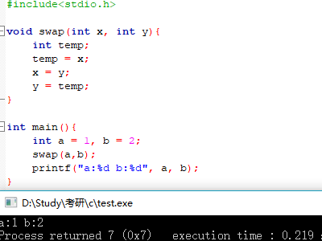
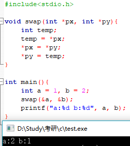
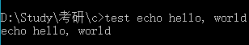
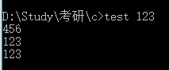
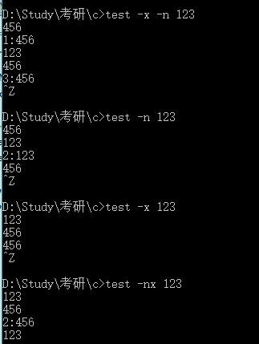

# Ch5 指针与数组

### 5.1 指针与地址

~~~c
p = &c // 把c的地址赋给变量p
~~~

**地址运算符&**只能应用于**内存中**的对象，即**变量与数组元素**，不能作用于表达式、常量或register类型的变量

**间接寻址或间接引用运算符***当它作用于指针时，将访问指针所指向的对象

~~~c
#include<stdio.h>

int main(){
    int x = 1, y = 2, z[10];
    int *ip; // ip是指向int类型的指针
    ip = &x; // ip现在指向x
    y = *ip; // y的值现在为1
    *ip = 0; // x的值现在为0
    ip = &z[0]; // ip现在指向z[0]
}
~~~

对函数的声明也可以采用这种方法。

~~~c
double *dp, atof(char*); // *dp和atof(s)的值都是double类型，且atof的参数是一个指向char类型的指针
~~~

**每个指针都必须指向某种特定的数据类型**

*注*：一个例外情况是**指向void类型的指针可以存放指向任何类型的指针**，但它**不能间接引用其自身**（5.11详细讨论）

如果指针ip指向整型变量x，那么在x可以出现的任何上下文中都可以使用*ip, 因此语句

~~~~c
*ip = *ip + 10;
~~~~

把ip指向的值 即x 的值增加10

**一元运算符*和&的优先级比算术运算符的优先级高**

~~~c
y = *ip + 1; // 把*ip指向的对象的值取出并加1，然后再将结果赋予y
~~~

~~~c
*ip += 1; // 将ip指向的对象的值加1 等同于++*ip 或 (*ip)++ 
~~~

*注* ：

**(*ip)++**中的圆括号是必须的，否则该表达式将对ip进行加1运算，而不是对ip指向的对象进行加1运算，这是因为类似于*****和**++**这样的一元运算符遵循从右至左的结合顺序。


由于指针也是变量，所以在程序中可以直接使用，而不必通过间接引用的方法使用，例如，如果iq是另一个指向整型的指针

~~~c
iq = ip; // 将把ip中的值拷贝到iq中，这样指针iq也将指向ip指向的对象
~~~

### 5.2 指针与函数参数

C语言是以**传值**的方式将参数值传递给被调用函数，因此被调用函数**不能直接**修改主调函数中变量的值

例如

~~~c
void swap(int x, int y){
    int temp;
    temp = x;
    x = y;
    y = temp;
}

~~~

由于参数传递采用传值方式，因此上述的swap函数不会影响到调用它的例程中参数a和b的值



为实现交换的目的，可以使主调程序将指向所要交换的变量的指针传递给被调函数即

~~~c
#include<stdio.h>

void swap(int *px, int *py){ // 通过指针间接访问操作数
    int temp;
    temp = *px;
    *px = *py;
    *py = temp;
}

int main(){
    int a = 1, b = 2;
    swap(&a, &b); // &a：指向变量a的指针
    printf("a:%d b:%d", a, b);
}
~~~




函数getint接受自由格式的输入，并执行转换，将输入的字符流分解成整数，且每次调用得到一个整数

将标识是否到达文件结尾的状态作为getint函数的返回值，同时使用一个指针参数储存转换后得到的整数并传回给主调函数

~~~c
int n, array[SIZE], getint(int*);

for(n=0; n<SIZE && getint(&array[n])!=EOF; n++);// 必须将array[n]的地址传递给函数getint
											// 否则函数getint将无法把转换得到的整数传回调用者
~~~

*注*

每次调用getint时，输入流中的下一个整数 将 被赋值给数组元素array[n]，同时n的值＋1


~~~c
#include<stdio.h>
#include<ctype.h>

int getch(void);
void ungetch(int);

// 该版本的getint在到达文件结尾时返回EOF，当下一个输入不是数字时返回0，当输入中包含一个有意义的数字时传回给调用者
// 将输入中的下一个整形数赋给*pn
int getint(int *pn){
    int c, sign;
    while(isspace(c = getch())) // 跳过空白符
    ;
    if(!isdigit(c) && c!=EOF && c!='+' && c!= '-'){
        ungetch(c); // 输入不是一个数字
        return 0;
    }
    sign = (c == '-') ? -1 : 1;
    if(c == '+' || c == '-') // 这里的c是上方getch得到的
        c = getch();
    for(*pn=0; isdigit(c); c=getch())
        *pn = 10 * *pn + (c - '0');
    *pn *= sign; // 恢复其正负号 并同时将转换后的整数返回给主调函数
    if(c != EOF) // 上方得到的c
        ungetch(c);
    return c;
}

# define BUFSIZE 100

char buf[BUFSIZE]; // 用于ungetch()函数的缓冲区
int bufp = 0; // buf中下一个空闲位置

// 取一个字符（可能是压回的字符）
int getch(void){
    return (bufp > 0) ? buf[--bufp] : getchar();
}

// 把字符压回输入中
void ungetch(int c){
    if(bufp >= BUFSIZE)
        printf("ungetch: too many characters\n");
    else
        buf[bufp++] = c;
}

int main(){
    int n, array[5]={0}, getint(int*);
    for(n=0; n<5 && getint(&array[n])!=EOF; n++);// 必须将array[n]的地址传递给函数getint
                                                // 否则函数getint将无法把转换得到的整数传回调用者
    int i;
    for(i=0; i<5; i++)
        printf("%d\n",array[i]);
}
~~~

#### 5-1 在上面的例子中，如果符号+或-的后面紧跟的不是数字，getint函数将把符号视为数字0的有效表达式。修改函数，将这种形式的+或-符号重新写回输入流中

~~~c
#include<stdio.h>
#include<ctype.h>

int getch(void);
void ungetch(int);

// 将输入中的下一个整形数赋给*pn
int getint(int *pn){
    int c, sign;
    while(isspace(c = getch())) // 跳过空白符
    ;
    if(!isdigit(c) && c!=EOF && c!='+' && c!= '-'){
        ungetch(c); // 输入不是一个数字
        return 0;
    }
    sign = (c == '-') ? -1 : 1;
    if(c == '+' || c == '-'){
        char tempsign = c;
        if(!isdigit(c=getch())){
            ungetch(tempsign);
            if(c != EOF)
                ungetch(c);
            return tempsign;
        }
    }
    for(*pn=0; isdigit(c); c=getch())
        *pn = 10 * *pn + (c - '0');
    *pn *= sign; // 恢复其正负号 并同时将转换后的整数返回给主调函数
    if(c != EOF) // 上方得到的c
        ungetch(c);
    return c;
}

# define BUFSIZE 100

char buf[BUFSIZE]; // 用于ungetch()函数的缓冲区
int bufp = 0; // buf中下一个空闲位置

// 取一个字符（可能是压回的字符）
int getch(void){
    return (bufp > 0) ? buf[--bufp] : getchar();
}

// 把字符压回输入中
void ungetch(int c){
    if(bufp >= BUFSIZE)
        printf("ungetch: too many characters\n");
    else
        buf[bufp++] = c;
}

int main(){
    int n, array[5]={1,1,1,1,1}, getint(int*);
    for(n=0; n<5 && getint(&array[n])!=EOF; n++);// 必须将array[n]的地址传递给函数getint
                                                // 否则函数getint将无法把转换得到的整数传回调用者
    int i;
    for(i=0; i<5; i++)
        printf("%d\n",array[i]);
    return 0;
}
~~~

#### 5-2 模仿getint的实现方法，编写一个读取浮点数的函数getfloat。getfloat的返回类型应该是什么？

返回类型int 因为getfloat函数将返回EOF或者紧跟在浮点数后面那个字符的ASCII值，因此返回int

~~~c
#include<stdio.h>
#include<ctype.h>

int getch(void);
void ungetch(int);

// 模仿getint的实现方法，编写一个读取浮点数的函数getfloat
// 自己写的版本
int getfloat(float *pn){
    char c;
    int sign = 1; // 记录符号 默认为正

    while(isspace(c = getch())); // 跳过空白符

    if(!isdigit(c) && c!='+' && c!='-' && c!='.' && c!=EOF){ // 非数字返回0
        ungetch();
        return 0;
    }

    char tempsign; // 记录符号
    if(c == '+' || c == '-'){
        sign = (c == '-') ? -1 : 1;
        tempsign = c;
        c = getch();
    }
    if(!isdigit(c)){ // + - 后跟的不是数字
        ungetch(tempsign);
        if(c != EOF)
            ungetch(c);
    }
    else{ // + - 后为数字
        *pn = 0.0; // 初始为0
        for(; isdigit(c); c=getch()){ // 整数部分
            *pn = 10.0 * *pn + (c - '0');
        }
        if(c == '.'){ // 有小数部分
            float decimal = 0; // 记录小数部分
            int i = 1; // 记录小数位数
            for(; isdigit(c = getch()); i*=10){
                decimal = 10.0 * decimal + (c - '0');
            }
            if(decimal != 0){
                decimal = decimal / i;
            }
            *pn = *pn + decimal;
        }
        else if(c != EOF)
            ungetch(c);
        *pn = sign * *pn; // 保证正负号正确
        return c;
    }
}

// 教材
int getfloat(float *pn){
    int c, sign;
    float power;

    while(isspace(c = getch()));

    if(!isdigit(c) && c!=EOF && c!='.' && c!='+' && c!='-'){
        ungetch(c);
        return 0;
    }
    sign = (c == '-') ? -1 : 1;
    if(c == '+' || c == '-')
        c = getch();
    for(*pn = 0.0; isdigit(c); c = getch())
        *pn = 10.0 * *pn + ( c - '0' );
    if(c == '.')
        c = getch();
    for(power=1.0; isdigit(c); c = getch()){
        *pn = 10.0 * *pn + (c - '0');
        power *=10.0;
    }
    *pn *= sign / power;
    if(c != EOF)
        ungetch(c);
    return c;
}

# define BUFSIZE 100

char buf[BUFSIZE]; // 用于ungetch()函数的缓冲区
int bufp = 0; // buf中下一个空闲位置

// 取一个字符（可能是压回的字符）
int getch(void){
    return (bufp > 0) ? buf[--bufp] : getchar();
}

// 把字符压回输入中
void ungetch(int c){
    if(bufp >= BUFSIZE)
        printf("ungetch: too many characters\n");
    else
        buf[bufp++] = c;
}

int main(){
    int n, getfloat(float*);
    float array[5]={0.0};
    for(n=0; n<5 && getfloat(&array[n])!=EOF; n++);// 必须将array[n]的地址传递给函数getfloat
                                                    // 否则函数getfloat将无法把转换得到的整数传回调用者
    int i;
    for(i=0; i<5; i++)
        printf("%f\n",array[i]);
    return 0;
}
~~~

### 5.3 指针与数组

~~~c
int a[10];
int *pa;
pa = &a[0]; // 将指针pa指向数组a的第0个元素 即pa的值是元素a[0]的地址
x = *pa; // 把数组a[0]中的内容复制给变量x
pa + i; // 数组元素a[i]的地址
*(pa + i); // 引用数组元素a[i]的内容
~~~

*注*

``pa = &a[0];``等价于``pa = a;``

对数组元素**a[i]的引用**也可写为``*(a + i)``

``&a[i]``与``a + i``的含义相同


当数组名传递给一个函数时，实际上传递的是该数组的第一个元素的地址

在被调用函数中，该参数是一个局部变量，因此数组名参数必须是一个指针

~~~c
// 另一个版本的strlen
int strlen(char *s){
    int n;
    for(n=0; *s != '\0'; s++)
    	n++;
    return n;
}
~~~


在函数定义时``char s[]; ``等价于``char *s;``

``f(&a[2])``等价于``f(a+2)``

``f(int arr[]){...}``等价于``f(int *a){...}``

### 5.4 地址算术符

存储分配程序

alloc(n)返回一个指向n个连续字符存储单元的指针，alloc函数的调用者可以利用该指针存储字符序列。

afree(p)释放已分配的存储空间，以便以后重用。

alloc与afree以栈（后进先出）的方式进行存储空间的管理

~~~c
#define ALLOCSIZE 10000 // 可用空间大小

static char allocbuf[ALLOCSIZE]; // alloc使用的存储区
static char *allocp = allocbuf; // 下一个空闲位置

char *alloc(int n){ // 返回指向n个字符的指针
    if(allocbuf + ALLOCSIZE - allocp >= n){ // 有足够的空间
        allocp += n;
        return allocp - n; // 分配前的指针
    }
    else
        return 0; 
}

void afree(char *p){ // 释放p指向的存储区
    if(p>=allcbuf && p<allocbuf+ALLOCSIZE)
        allocp = p;
}
~~~


如果指针p和q指向**同一组数组**的成员，那么他们之间可以进行类似==、！=、<、<=的关系比较运算，例如

~~~c
p < q; // 若为真 则表示p指向的元素的位置在q指向的元素的位置之前
~~~

*注*

指向**不同数组**的元素指针之间的算术或比较运算**没有定义**

特例：**指针的算术运算中可使用数组最后一个元素的下一个元素的地址**


如果q和p指向**相同数组**中的元素，且p<q，那么``q-p+1``表示**位于p和q指向的元素之间的元素的数目**

由此写另一个版本的strlen函数

~~~~c
int strlen(char *s){
    char *p = s;
    while(*p != '\0')
    	p++;
    return p-s;
}
~~~~

### 5.5 字符指针与函数

~~~c
char *pmessage;
pmessage = "now is the time";
~~~

把一个指向该字符数组的指针赋给pmessage，该过程并没有进行字符串的复制，**只是涉及指针的操作**

*C语言中没有提供将整个字符串作为一个整体进行处理的运算符*


~~~~c
char amessage[] = "now is the time"; // 定义一个数组
char *pmessage = "now is the time"; // 定义一个指针
~~~~

*注*

amessage是一个仅仅足以存放初始化字符串以及空字符'\0'的一组数组，**数组中单个字符可以修改，但amessage始终指向同一个存储位置**

pmessage是一个指针，其初值指向一个字符串常量，之后可以被修改指向其他地址，**但如果试图修改字符串的内容，结果没有定义**


将指针t指向的字符串复制到指针s指向的位置；使用数组下标实现的版本

这里把指针t指向的字符串复制到指针s指向的位置

~~~c
void strcpy(char *s, char *t){
    int i;
    i = 0;
    while((s[i] = t[i]) != '\0')
    	i++;
}
~~~

将指针t指向的字符串复制到指针s指向的位置；使用指针方式实现的版本1

~~~
void strcpy(char *s, char *t){
    while((*s = *t) != '\0'){
        s++;
        t++;
    }
}
~~~

*注* 

如果使用``s = t``**实质上只拷贝了指针，而并没有复制字符**

将指针t指向的字符串复制到指针s指向的位置；使用指针方式实现的版本2

~~~c
void strcpy(char *s, char *t){
    while((*s++ = *t++) != '\0')
        ;
}
~~~

``*t++``的值是执行自增运算符**之前**t所指向的字符

**后缀**运算符++表示在**在读取该字符后才改变t的值**

同样道理，在s执行自增运算之前，字符就被存储到指针s指向的旧位置，

**该字符同时也用来和空字符'\0'进行比较，以控制循环的执行**

最后的结果是一次将t指向的字符复制到s指向的位置，直到遇到结束符'\0'位置（同时也复制该结束符）


进一步精炼程序，表达式同‘\0’的比较是多余的，因为只要判断表达式的值是否为0

将指针t指向的字符串复制到指针s指向的位置；使用指针方式实现的版本3

~~~c
void strcpy(char *s, char *t){
    while((*s++ = *t++))
        ;
}
~~~

**标准库<string.h>中提供的函数strcpy把目标字符串作为函数值返回**


字符串比较函数strcmp(s,t)：比较字符串s和t并根据s按照字典序小于、等于、大于的结果分别返回负整数、0、正整数，返回值是s和t由前向后逐字符比较时遇到的第一个不相等字符处的字符的差值

~~~c
int strcmp(char *s, char *t){
    int i;
    for(i=0; s[i]==t[i]; i++)
    	if(s[i] == '\0')
    		return 0;
    return s[i] - t[i];
}
~~~

用指针方式实现

~~~c
int strcmp(char *s, char *t){
    for(; *s == *t; s++, t++)
    	if(*s == '\0')
    		return 0;
    return *s - *t;
}
~~~


***--p** : 在读取指针p指向的字符之前先对p执行自减运算


进栈出栈的标准用法

~~~c
*p++ = val; // 将val压入栈
val = *--p; // 将栈顶元素弹出到val中
~~~


#### 5-3 指针方式实现第二章的函数的strcat，函数strcat(s, t)将t指向的字符串复制到s指向的字符串的尾部

~~~c
# include<stdio.h>

void strcat(char *s, char *t){
    while(*s != '\0')
        s++;
    while(*s++ = *t++);
}

main(){
    char s[10] = "abc";
    char t[10] = "123";
    strcat(s,t);
    printf("%s", s);
}

~~~

#### 5-4 编写strend(s, t) 如果字符串t出现在字符串s的尾部，该函数返回1；否则返回0

~~~c
# include<stdio.h>
// 自己写的版本
int strend(char *s, char *t){
    int i=0, j=0;
    char *tp = t;
    while(*s != '\0'){
        s++;
        i++;
    }
    while(*t != '\0'){
        t++;
        j++;
    }
    if(i >= j){
        while(*s == *t && t!= tp){
            //printf("%c %c\n", *s, *t);
            s--;
            t--;
        }
        if(t != tp)
            return 0;
        else
            return 1;
    }
    else
        return 0;
}

main(){
    char s1[10] = "abc123";
    char s2[10] = "23";
    char t1[10] = "123";
    char t2[10] = "abc";
    printf("s1t1 %d\n", strend(s1,t1));
    printf("s1t2 %d\n", strend(s1,t2));
    printf("s2t1 %d\n", strend(s2,t1));
}
~~~

~~~c
// 教材
# include<stdio.h>

int strend(char *s, char *t){
    char *bs = s;
    char *bt = t;

    for(; *s; s++);
    for(; *t; t++);
    for(; *s == *t; s--, t--){
        if(t == bt || s == bs)
            break;
    }
    if(*s == *t && t == bt && *s!='\0')
        return 1;
    else
        return 0;
}

main(){
    char s1[10] = "abc123";
    char s2[10] = "23";
    char t1[10] = "123";
    char t2[10] = "abc";
    printf("s1t1 %d\n", strend(s1,t1));
    printf("s1t2 %d\n", strend(s1,t2));
    printf("s2t1 %d\n", strend(s2,t1));
}
~~~

#### 5-5 实现库函数strncpy、strncat和strncmp，他们最多对参数字符串中的前n个字符尽心操作。例如strncpy(s, t, n)将t中最多前n个字符复制到s中

~~~c
// 自己写的版本
#include <stdio.h>
// 实现库函数strncpy、strncat和strncmp，他们最多对参数字符串中的前n个字符尽心操作。
// 例如strncpy(s, t, n)将t中最多前n个字符复制到s中
void strncpy(char *s, char *t, int n){
    while(n--){
        (*s++) = (*t++);
    }
    *s = '\0';
}

void strncat(char *s, char *t, int n){
    while(*s++ != '\0');
    *s--;
    while(n--){
        *s++ = *t++;
    }
    *s = '\0';
}

int strncmp(char *s, char *t, int n){ // 错误 未处理s长度<n的情况
    for(; n && *s == *t; s++, t++, n--);
    if(n == 0)
        return 0;
    return *s - *t;
}

int main(){
    char s[10] = "123456";
    char t[10] = "12375";
    //strncpy(s, t, 3);
    //strncat(s,t,6);
    //printf("%s",s);
    printf("%d", strncmp(s,t,5));
    return 0;
}
~~~

~~~c
// 教材
#include <stdio.h>
// 实现库函数strncpy、strncat和strncmp，他们最多对参数字符串中的前n个字符尽心操作。
// 例如strncpy(s, t, n)将t中最多前n个字符复制到s中
void strncpy(char *s, char *t, int n){
    while(*t && n--){
        (*s++) = (*t++);
    }// 若t中内容短于n会将t末尾的'\0'复制过去
    while(n-- > 0) // 若t中的数量<n
        *s = '\0';
}

void strncat(char *s, char *t, int n){
    int strlen(char*);
    strncpy(s+strlen(s), t, n);
}

int strncmp(char *s, char *t, int n){
    for(; *s == *t; s++, t++, n--)
        if(--n <= 0 || *s == '\0')
            return 0;
    return *s - *t;
}

int main(){
    char s[10] = "123";
    char t[10] = "12375";
    //strncpy(s, t, 3);
    //strncat(s,t,6);
    //printf("%s",s);
    printf("%d", strncmp(s,t,4));
    return 0;
}
~~~

#### 5-6 采用指针而非数组索引方式改写getline、atoi、itoa以及他们的变体形式，reverse、strindex、getop等

### 5.6 指针数组以及指向指针的指针

对文本进行排序

1. 读取所有输入行
2. 对文本进行排序
3. 按次序打印文本

~~~c
#include <stdio.h>
#include <string.h>

#define MAXLINES 5000 // 进行排序的最大文本行数

char *lineptr[MAXLINES]; // 指向文本行的指针数组

int readlines(char *lineptr[], int nlines);
void writelines(char *lineptr[], int nlines);

void qsort_(char *lineptr[], int left, int right);

// 对输入文本进行排序
main(){
    int nlines; // 读取输入行数目

    if((nlines = readlines(lineptr, MAXLINES)) >= 0){
        qsort_(lineptr, 0, nlines-1);
        writelines(lineptr, nlines);
        return 0;
    }
    else{
        printf("error: input too big to sort\n");
        return 1;
    }
}

#define MAXLEN 1000 // 每个输入行的最大长度
int getline(char *, int);
char *alloc(int);

#include <malloc.h>
char *alloc(int n){
    return (char*)malloc(n*sizeof(char));
}

int getline(char *s, int max){
    char c;
    char *t = s;
    while(--max>0 && (c = getchar())!=EOF && c!='\n')
        *s++ = c;
    if(c == '\n')
        *s++ = c;
    *s = '\0';
    return s - t;
}

// readlines: 读取输入行
int readlines(char *lineptr[], int maxlines){
    int len, nlines;
    char *p, line[MAXLEN];
    nlines = 0;
    while((len = getline(line, MAXLEN)) > 0){ // 获取输入行的输入字符个数
        if(nlines >= maxlines || (p = alloc(len)) == NULL)
            return -1;
        else{
            line[len-1] = '\0'; // 删除换行符
            strcpy(p, line);
            lineptr[nlines++] = p;
        }
    }
    return nlines;
}

// writelines：写输入行
/*void writelines(char *lineptr[], int nlines){
    int i;

    for(i=0; i<nlines; i++){
        printf("%s\n", lineptr[i]);
    }
}*/
// 由于lineptr本身是个数组名，因此可将writelines写为
void writelines(char *lineptr[], int nlines){
    while(nlines--){
        printf("%s\n",*lineptr++);
    }
}

// qsort: 按递增顺序对v[left]...v[right]进行排序
void qsort_(char*v[], int left, int right){

    int i, last;
    void swap(char *v[], int i, int j);

    if(left >= right)
        return;

    swap(v, left, (left + right)/2); // 将一开始中间位置的数作为枢轴并将它放到首位，即与第一个位置的数交换
    last = left;

    for(i=left+1; i<=right; i++){
        if(strcmp(v[i], v[left]) < 0) // 将接下来的每个数与首位枢轴的数（即v[left]）相比较
            swap(v, ++last, i);       // last记录最近（最右）一个满足小于数轴数的位置
    }                                 // 下一位i如果小于数轴，则将i和last+1位置的数交换，并让last往后移一位，保证last指向的特性

    swap(v, left, last);    // 将枢轴的数和最右一个比枢轴小的数交换位置
                            // 现在last位置上的数为这一轮的枢轴数，完成last右边都小于它，左边都大于它
    qsort_(v, left, last-1); // 递归划分
    qsort_(v, last+1, right);
}

// swap: 交换v[i]和v[j]
void swap(char *v[], int i, int j){
    char *temp;
    temp = v[i];
    v[i] = v[j];
    v[j] = temp;
}

~~~

#### 5-7 *重写readlines，将输入的文本行存储到由main函数提供的一个数组中，而不是存储到调用的alloc分配的存储空间。该函数的运行速度比改写前快多少？

比原始版本快一点点

~~~c
#include <stdio.h>
#include <string.h>

#define MAXLINES 5000 // 进行排序的最大文本行数
#define MAXSTOR 5000

char *lineptr[MAXLINES]; // 指向文本行的指针数组

int readlines(char *lineptr[], int nlines, char *temp);
void writelines(char *lineptr[], int nlines);

void qsort_(char *lineptr[], int left, int right);

// 对输入文本进行排序
main(){
    int nlines; // 读取输入行数目
    char temp[MAXSTOR];

    if((nlines = readlines(lineptr, MAXLINES,temp)) >= 0){
        qsort_(lineptr, 0, nlines-1);
        writelines(lineptr, nlines);
        return 0;
    }
    else{
        printf("error: input too big to sort\n");
        return 1;
    }
}

#define MAXLEN 1000 // 每个输入行的最大长度
int getline(char *, int);
char *alloc(int);

#include <malloc.h>
char *alloc(int n){
    return (char*)malloc(n*sizeof(char));
}

int getline(char *s, int max){
    char c;
    char *t = s;
    while(--max>0 && (c = getchar())!=EOF && c!='\n')
        *s++ = c;
    if(c == '\n')
        *s++ = c;
    *s = '\0';
    return s - t;
}

// readlines: 读取输入行
int readlines(char *lineptr[], int maxlines, char *temp){
    int len, nlines;
    char line[MAXLEN];
    char *p = temp;
    char *linestop = temp + MAXSTOR;

    nlines = 0;
    while((len = getline(line, MAXLEN)) > 0){ // 获取输入行的输入字符个数
        if(nlines >= maxlines || p+len > linestop)
            return -1;
        else{
            line[len-1] = '\0'; // 删除换行符
            strcpy(p, line);
            lineptr[nlines++] = p;
            p += len;
        }
    }
    return nlines;
}

// writelines：写输入行
/*void writelines(char *lineptr[], int nlines){
    int i;

    for(i=0; i<nlines; i++){
        printf("%s\n", lineptr[i]);
    }
}*/
// 由于lineptr本身是个数组名，因此可将writelines写为
void writelines(char *lineptr[], int nlines){
    while(nlines--){
        printf("%s\n",*lineptr++);
    }
}

// qsort: 按递增顺序对v[left]...v[right]进行排序
void qsort_(char*v[], int left, int right){

    int i, last;
    void swap(char *v[], int i, int j);

    if(left >= right)
        return;

    swap(v, left, (left + right)/2); // 将一开始中间位置的数作为枢轴并将它放到首位，即与第一个位置的数交换
    last = left;

    for(i=left+1; i<=right; i++){
        if(strcmp(v[i], v[left]) < 0) // 将接下来的每个数与首位枢轴的数（即v[left]）相比较
            swap(v, ++last, i);       // last记录最近（最右）一个满足小于数轴数的位置
    }                                 // 下一位i如果小于数轴，则将i和last+1位置的数交换，并让last往后移一位，保证last指向的特性

    swap(v, left, last);    // 将枢轴的数和最右一个比枢轴小的数交换位置
                            // 现在last位置上的数为这一轮的枢轴数，完成last右边都小于它，左边都大于它
    qsort_(v, left, last-1); // 递归划分
    qsort_(v, last+1, right);
}

// swap: 交换v[i]和v[j]
void swap(char *v[], int i, int j){
    char *temp;
    temp = v[i];
    v[i] = v[j];
    v[j] = temp;
}
~~~

### 5.7 多维数组

~~~c
static char daytab[2][13] = {
    {0,31,28,31,30,31,30,31,31,30,31,30,31},
    {0,31,29,31,30,31,30,31,31,30,31,30,31}
}
~~~

~~~c
#include <stdio.h>
#include <string.h>

static char daytab[2][13] = {
    {0,31,28,31,30,31,30,31,31,30,31,30,31},
    {0,31,29,31,30,31,30,31,31,30,31,30,31}
};

// 将某年某月的日期表示形式转换为某年中的第几天
int day_of_year(int year, int month, int day){
    int i, leap;

    leap = year%4 == 0 && year%100 != 0 || year%400 == 0;
    for(i=1; i<month; i++)
        day += daytab[leap][i];
    return day;
}

// 将某年中的第几天的日期表示形式转换为某年某月的表示形式
void month_day(int year, int yearday, int *pmonth, int *pday){
    int i, leap;

    leap = year%4 == 0 && year%100 != 0 || year%400 == 0;
    for(i=1; yearday > daytab[leap][i]; i++)
        yearday -= daytab[leap][i];
    *pmonth = i;
    *pday = yearday;
}

main(){
    int year = 2018;
    int month = 2;
    int day = 1;
    int datemonth, dateday;
    int yearday = 32;
    int *pmonth = &datemonth; // 注意指针创建并初始化
    int *pday = &dateday;
    printf("%d\n", day_of_year(year, month, day));
    month_day(year, yearday, pmonth, pday);
    printf("%d %d\n", *pmonth, *pday);
}
~~~

如果将daytab**作为参数**传给函数f，则f的声明应该写成下列形式

~~~c
f(int daytab[2][13]){...}
// 或
f(int daytab[][13]){...}
// 或
f(int (*daytab)[13]){...}// 表明参数是一个指针，指向具有13个整形元素的一维数组  指向数组的指针
~~~

注意

**[]运算符优先级高于*运算符**

**指针数组**``int *daytab[13]``相当于声明一个数组，该数组有13个元素，其中每个元素都是一个指向整形对象的**指针**

**指向数组的指针**``int (*daytab)[13])`` 表明参数是一个指针，指向具有13个整形元素的一维数组  指向数组的指针

####  5-8 对函数day_of_year和month_day进行错误检查

~~~~c
#include <stdio.h>
#include <string.h>

static char daytab[2][13] = {
    {0,31,28,31,30,31,30,31,31,30,31,30,31},
    {0,31,29,31,30,31,30,31,31,30,31,30,31}
};

// 将某年某月的日期表示形式转换为某年中的第几天
int day_of_year(int year, int month, int day){
    int i, leap;

    leap = year%4 == 0 && year%100 != 0 || year%400 == 0;
    if(month>12 || month<1 || day > daytab[leap][month] || day < 1)
        return -1;
    for(i=1; i<month; i++)
        day += daytab[leap][i];
    return day;
}

// 将某年中的第几天的日期表示形式转换为某年某月的表示形式
void month_day(int year, int yearday, int *pmonth, int *pday){
    int i, leap;
    if(year < 1){
        *pmonth = -1;
        *pday = -1;
        return;
    }
    leap = year%4 == 0 && year%100 != 0 || year%400 == 0;
    if((leap==0 && (yearday>365 || yearday<1) || (leap == 1 && (yearday>366 || yearday<1)){
        *pmonth = -1;
        *pday = -1;
        return;
    }
    for(i=1; yearday > daytab[leap][i]; i++)
        yearday -= daytab[leap][i];
    *pmonth = i;
    *pday = yearday;
}

main(){
    int year = 2018;
    int month = 2;
    int day = 1;
    int datemonth, dateday;
    int yearday = 365;
    int *pmonth = &datemonth; // 注意指针创建并初始化
    int *pday = &dateday;
    printf("%d\n", day_of_year(year, month, day));
    month_day(year, yearday, pmonth, pday);
    printf("%d %d\n", *pmonth, *pday);
}
~~~~

### 5.8 指针数组的初始化

~~~c
// 返回第n个月的名字
char *month_name(int n){
	static char *name[] = {
        "Illegle month", "January","Feb", "Mar","Apr","May","Jun", "Aug", 			
        "Sep","Oct","Nov","Dec"
	};
	return (n<1 || n>12) ? name[0] : name[n];
}
~~~

### 5.9 指针与多维数组

~~~c
int a[10][20]; // 二维数组分配200个int类型长度的存储空间
int *b[10]; // 仅分配10个指针，没有初始化
~~~

`a[3][4]` 和 `b[3][4]`都是对一个int对象的合法应用

~~~c
// 指针数组
char *name[] = {"Illegal", "Jan", "Feb", "Mar"};

// 二维数组
char aname[][15] = {"Illegal", "Jan", "Feb", "Mar"};
~~~

#### 5-9 用指针方式代替数组下标方式改写函数day_of_year和month_day

~~~c
#include <stdio.h>
#include <string.h>

static char daytab[2][13] = {
    {0,31,28,31,30,31,30,31,31,30,31,30,31},
    {0,31,29,31,30,31,30,31,31,30,31,30,31}
};

// 将某年某月的日期表示形式转换为某年中的第几天
int day_of_year(int year, int month, int day){
    int leap;
    char *p;

    leap = year%4 == 0 && year%100 != 0 || year%400 == 0;
    p = daytab[leap];
    if(month>12 || month<1 || day > p+month || day < 1)
        return -1;
    while(--month)
        day += (*++p);
    return day;
}

// 将某年中的第几天的日期表示形式转换为某年某月的表示形式
void month_day(int year, int yearday, int *pmonth, int *pday){
    int leap;
    char *p;
    if(year < 1){
        *pmonth = -1;
        *pday = -1;
        return;
    }
    leap = year%4 == 0 && year%100 != 0 || year%400 == 0;
    p = daytab[leap];
    if((leap==0 && yearday>365) || (leap == 1 && yearday>366)){
        *pmonth = -1;
        *pday = -1;
        return;
    }
    while(yearday > *++p)
        yearday -= *p;
    *pmonth = p - *(daytab + leap); // 注意
    *pday = yearday;
}

main(){
    int year = 2018;
    int month = 2;
    int day = 1;
    int datemonth, dateday;
    int yearday = 365;
    int *pmonth = &datemonth; // 注意指针创建并初始化
    int *pday = &dateday;
    printf("%d\n", day_of_year(year, month, day));
    month_day(year, yearday, pmonth, pday);
    printf("%d %d\n", *pmonth, *pday);
}
~~~

### 5.10 命令行参数

~~~c
#include <stdio.h>
// 回显程序命令行参数；版本1
main(int argc, char *argv[]){
    int i;

    for(i=1; i<argc; i++){
        printf("%s%s", argv[i], (i<argc-1) ? " " : "");
    }
    printf("\n");
    return 0;
}
~~~



~~~c
#include <stdio.h>
// 回显程序命令行参数；版本2
main(int argc, char *argv[]){
    while(--argc){
        printf("%s%s", *++argv, (argc>1) ? " " : "");
    }
    printf("\n");
    return 0;
}
~~~


通过命令行的第一个参数制定带匹配的模式

~~~c
#include <stdio.h>
#include <string.h>
#define MAXLINE 1000

int getline(char *line, int max);

int getline(char *s, int max){
    char c;
    char *t = s;
    while(--max>0 && (c = getchar())!=EOF && c!='\n')
        *s++ = c;
    if(c == '\n')
        *s++ = c;
    *s = '\0';
    return s - t;
}
// 打印与第一个参数指定的模式匹配的行
main(int argc, char *argv[]){
    char line[MAXLINE];
    int found = 0;

    if(argc != 2)
        printf("Usage: find pattern\n");
    else
        while(getline(line, MAXLINE) > 0)
            if(strstr(line, argv[1]) != NULL){
                printf("%s", line);
                found++;
            }
    return found;
}
~~~

strstr(s, t)函数返回一个指针，该指针指向字符串t在s中第一次出现的位置，若未出现返回NULL

 

进一步改进允许程序带有两个可选参数，其中一个参数表示**-x“打印除匹配模式之外的所有行”**，另一个参数表示    **-n“每个打印的文本行前面加上相应的行号”**

~~~c
#include <stdio.h>
#include <string.h>
#define MAXLINE 1000

int getline(char *line, int max);

int getline(char *s, int max){
    char c;
    char *t = s;
    while(--max>0 && (c = getchar())!=EOF && c!='\n')
        *s++ = c;
    if(c == '\n')
        *s++ = c;
    *s = '\0';
    return s - t;
}
// 打印与第一个参数指定的模式匹配的行
main(int argc, char *argv[]){
    char line[MAXLINE];
    long lineno = 0;
    int c, except = 0, number = 0, found = 0;

    while(--argc > 0 && (*++argv)[0] == '-'){// 见注
        while(c = *++argv[0]){
            switch(c){
            case 'x': // 打印除匹配模式之外的所有行
                except = 1;
                break;
            case 'n': // 每个打印的文本行前面加上相应的行号
                number = 1;
                break;
            default:
                printf("find : illegal option %c\n", c);
                argc = 0;
                found = -1;
                break;
            }
        }
    }
    if(argc != 1)
        printf("Usage: find -x -n pattern\n");
    else
        while(getline(line, MAXLINE) > 0){
            lineno++;
            if((strstr(line, *argv) != NULL) != except){ 
            // 输入的字符串在line中，一开始的模式在参数argv中
            // strstr(line, *argv) != NULL表示line在*argv中
            // 当上述值与except进行比较时，决定是匹配模式的输出还是不匹配的模式的输出 
                if(number)
                    printf("%ld:", lineno);
                printf("%s", line);
                found++;
            }
        }
    return found;
}
~~~



*注*

*++argv是一个指向参数字符串的指针

(*++argv)[0]是它的第一个字符，另一种有效形式是**++argv

因为[]与操作数的优先级比*和++高

*++argv[0]是对指针argv[0]进行了自增运算，目的是遍历一个特定的字符串

#### 5-10 *编写程序expr，以计算从命令行输入的逆波兰表达式的值，其中每个运算符或操作数用一个单独的参数表示。例如命令 *expr 2 3 4 + \**  将计算表达式 2\*(3+4)

~~~c
// 自己写的版本
#include <stdio.h>
#include <stdlib.h>
#include <ctype.h>
#define MAX 1000
#define NUMBER 1
#define ERROR -1
// 编写程序expr，以计算从命令行输入的逆波兰表达式的值，其中每个运算符或操作数用一个单独的参数表示。
// 例如命令 expr 2 3 4 + *  将计算表达式 2*(3+4)

float val[MAX];
float *valp = &val[0];
int valsum = 0; // 记录栈内有效值数目

float pop(){
    if(valsum == 0)
        printf("the stack is empty error\n");
    else{
        valsum--;
        return *--valp;
    }
}

void push(float a){
    if(valsum >= MAX)
        printf("the stack is full error\n");
    else{
        *valp = a;
        valp++;
        valsum++;
    }
}

int getop(char *str){
    char *p = str;
    if(isdigit(*p))
        return NUMBER;
    else if(strlen(str) == 1)
        return *p;
    else
        return ERROR;
}

main(int argc, char *argv[]){
    int c; // 记录操作数或操作符标识
    float op2 = 0;
    char *p;
    if(argc>1){
        p = argv[1];
        argv++;

        while(strcmp(p,"expr")==0 && --argc>1){
            c = getop(*++argv); // 将expr后的参数判断类型后返回到c
            //printf("%s %d\n",*argv,argc);
            switch(c){
            case NUMBER:
                push(atof(*argv));
                break;
            case '+':
                push(pop() + pop());
                break;
            case 'x':
                push(pop() * pop());
                break;
            case '-':
                op2 = pop();
                push(pop() - op2);
                break;
            case '/':
                op2 = pop();
                if(op2)
                    push(pop() / op2);
                else
                    printf("error div 0\n");
                break;
            case ERROR:
                printf("op error\n");
                break;
            }
            if(argc == 2)
                printf("result: %f\n", pop());
        }
        if(argc != 1)
            printf("illegal option %s\n", *argv);
    }
    return 0;
}
~~~

~~~c
// 教材 不太对 不想调试了
main(int argc, char *argv[]){
    char s[MAXOP];
    double op2;
    while(--argc > 0){
        ungets(" ");
        ungets(*++argv);
        switch(getop(s)){
        case NUMBER:
            push(atof(s));
            break;
        case '+':
            push(pop() + pop());
            break;
        case 'x':
            push(pop() * pop());
            break;
        case '-':
            op2 = pop();
            push(pop() - op2);
            break;
        case '/':
            op2 = pop();
            if(op2)
                push(pop() / op2);
            else
                printf("error div 0\n");
            break;
        default:
            printf("error:unknown command %s\n",s);
        }
    }
    printf("\t%.8g\n",pop());
    return 0;
}
~~~

####5-11 *修改第一章entab和detab，使他们接受一组作为参数的制表符停止位。如果启动程序时不带参数，则使用默认的制表符停止位设置 

数组tab中的每一个元素对应着文本行的一个位置，如果文本行的某个位置处有一个制表符停止位，与之对应的tab[i]元素就取值YES否则为NO

tab[]相当于一个标尺

~~~c
// entab
#include <stdio.h>

#define MAXLINE 100
#define TABING 8
#define YES 1
#define NO 0
void settab(int argc, char *agv[], char *tab);
void entable(char *tab);
int tabpos(int pos, char *tab);

main(int argc, char *argv[]){
    char tab[MAXLINE + 1];

    settab(argc, argv, tab);
    entab(tab);
    return 0;
}

void entab(char *tab){
    int c, pos;
    int nb = 0;
    int nt = 0;

    for(pos=1; (c=getchar())!=EOF; pos++){
        if(c == ' '){
            if(tabpos(pos,tab) == NO)
                ++nb;
            else{ // 将空格替换为tab
                nb = 0;
                ++nt;
            }
        }
        else{
            for(; nt>0; nt--)
                putchar('\t');
            if(c == '\t')
                nb = 0;
            else
                for(; nb>0; nb--)
                    putchar('^');
            putchar(c); // 普通字符
            if(c == '\n')
                pos = 0;
            else if(c == '\t')
                while(tabpos(pos, tab) != YES)
                    ++pos;
        }
    }
}

#include <stdlib.h>
void settab(int argc, char *argv[], char *tab){
    int i, pos;

    if(argc <= 1){ // 未设置参数 默认值制表符停止位位TABING
        for(i=1; i<=MAXLINE; i++){
            if(i % TABING == 0)
                tab[i] = YES;
            else
                tab[i] = NO;
        }
    }
    else{
        for(i=1; i<=MAXLINE; i++)
            tab[i] = NO; // 将所有文本置为没有制表停止位
        while(--argc > 0){
            pos = atoi(*++argv); // 获得参数 即制表符停止位数
            if(pos > 0 && pos <= MAXLINE)
                tab[pos] = YES;
        }
    }
}

int tabpos(int pos, char *tab){
    if(pos > MAXLINE)
        return YES;
    else
        return tab[pos];
}
~~~

~~~~c
// detab
#include <stdio.h>

#define MAXLINE 100
#define TABING 8
#define YES 1
#define NO 0
void settab(int argc, char *agv[], char *tab);
void detable(char *tab);
int tabpos(int pos, char *tab);

main(int argc, char *argv[]){
    char tab[MAXLINE + 1];

    settab(argc, argv, tab);
    detab(tab);
    return 0;
}

void detab(char *tab){
    int c, pos = 1;

    while((c = getchar()) != EOF){
        if(c == '\t'){
            do{
                putchar('^');
            }while(tabpos(pos++,tab) != YES);
        }
        else if(c == '\n'){
            putchar(c);
            pos = 1;
        }
        else{
            putchar(c); // 普通字符
            ++pos;
        }
    }
}

#include <stdlib.h>
void settab(int argc, char *argv[], char *tab){
    int i, pos;

    if(argc <= 1){ // 未设置参数 默认值制表符停止位位TABING
        for(i=1; i<=MAXLINE; i++){
            if(i % TABING == 0)
                tab[i] = YES;
            else
                tab[i] = NO;
        }
    }
    else{
        for(i=1; i<=MAXLINE; i++)
            tab[i] = NO; // 将所有文本置为没有制表停止位
        while(--argc > 0){
            pos = atoi(*++argv); // 获得参数 即制表符停止位数
            if(pos > 0 && pos <= MAXLINE)
                tab[pos] = YES;
        }
    }
}

int tabpos(int pos, char *tab){
    if(pos > MAXLINE)
        return YES;
    else
        return tab[pos];
}
~~~~


#### 5-12 *对程序entab和detab做一些扩充，已接受下列缩写的命令 *entab -m +n* 表示从第m列开始，每隔n列停止。选择（对使用者而言）比较方便的默认行为

~~~c
#include <stdio.h>

#define MAXLINE 100
#define TABING 8
#define YES 1
#define NO 0

void esettab(int atgc, char *argv[], char *tab);
void entab(char *tab);
int tabpos(int pos, char *tab);

main(int argc, char *argv[]){
    char tab[MAXLINE+1];
    esettable(argc, argv, tab);
    entab(tab);
    return 0;
}

#include <stdlib.h>
void esettable(int argc, char *argv[], char *tab){
    int i, inc, pos;
    if(argc <= 1){ // 默认情况
        for(i=1; i<=MAXLINE; i++){
            if(i % TABING == 0)
                tab[i] = YES;
            else
                tab[i] = NO;
        }
    }
    else if(argc == 3 && *argv[1]=='-' && *argv[2] == '+'){
        pos = atoi(&(*++argv)[1]); // 获取从第几列开始
        inc = atoi(&(*++argv)[1]); // 获取隔第几列
        for(i=1; i<=MAXLINE; i++){
            if(i != pos)
                tab[i] = NO;
            else{
                tab[i] = YES;
                pos += inc; // 每个inc列均为制表符停止位
            }
        }
    }
    else{
        for(i=1; i<=MAXLINE; i++){
            tab[i] = NO;
        }
        while(--argc>0){
            pos = atoi(*++argv);
            if(pos > 0 && pos <= MAXLINE)
                tab[pos] = YES;
        }
    }
}

void entab(char *tab){
    int c, pos;
    int nb = 0;
    int nt = 0;
    for(pos=1; (c = getchar())!= EOF; pos++){
        if(c == ' '){
            if(tabpos(pos,tab) == NO)
                nb++;
            else{
                nb = 0;
                nt++;
            }
        }
        else{
            for(; nt>0; nt--)
                putchar('\t');
            if(c == '\t')
                nb = 0;
            else
                for(; nb>0; nb--)
                    putchar('^');
            putchar(c);
            if(c == '\n')
                pos = 0;
            else if(c == '\t')
                while(tabpos(pos,tab) != YES)
                    ++pos;
        }
    }
}

int tabpos(int pos, char*tab){
    if(pos > MAXLINE)
        return YES;
    else
        return tab[pos];
}
~~~

#### 5-13 *编写tail，将其输入的最后n行打印出来。默认情况下，n的值为10，但可以通过一个可选参数改变n的值，因此命令  *tail -n*  将打印其输入最后n行，无论输入或n的值是否合理，该程序都应该能正常运行。编写的程序要充分利用存储空间；输入行的存储方式应该与5.6节的排序程序的存储方式一致，而不采用固定长度的二维数组

~~~c
#include <stdio.h>
#include <stdlib.h>
#include <string.h>

#define DEFLINES 10
#define LINES 100
#define MAXLEN 100

void error(char *);
int getline(char*, int);

main(int argc, char *argv[]){
    char *p;
    char *buf; // 指向缓存区
    char *bufend; // 指向缓存区末尾
    char line[MAXLEN]; // 当前输入行
    char *lineptr[LINES];
    int first, i, last, len, n, nlines;
    if(argc == 1)
        n = DEFLINES;
    else if(argc == 2 && (*++argv)[0] == '-')
        n = atoi(argv[0]+1);
    else
        error("usage: tail[-n]");
    if(n<1 || n>LINES) // 不合理的n值输出默认输出行
        n = LINES;
    for(i=0; i<LINES; i++)
        lineptr[i] = NULL;
    if((p = buf = malloc(LINES * MAXLEN)) == NULL)
        error("tail: cannot allocate buf");
    bufend = buf + LINES * MAXLEN; // 记录缓存区末尾
    last = 0;
    nlines = 0;
    while((len = getline(line, MAXLEN)) > 0){
        if(p + len + 1 >=bufend)
            p = buf; // 缓存区无足够空间存放当前输入行，把p重新设置为指向缓冲区开头
        lineptr[last] = p;
        strcpy(lineptr[last], line); // 将当前行放入
        if(++last >= LINES)
            last = 0;
        p += len + 1;
        nlines++;
    }
    if(n > nlines)
        n = nlines;
    first = last - n;
    if(first < 0)
        first += LINES;
    for(i=first; n-->0; i=(i+1)%LINES)
        printf("%s",lineptr[i]);
    return 0;
}

void error(char *s){
    printf("%s\n",s);
    exit(1);
}

int getline(char *s, int lim){
    int c;
    char *t = s;
    while(--lim>0 && (c=getchar())!=EOF && c != '\n')
        *s++ = c;
    if(c == '\n')
        *s++ = c;
    *s = '\0';
    return s-t;
}
~~~

### 5.11 指向函数的指针

~~~c
#include <stdio.h>
#include <string.h>

#define MAXLINE 5000 // 待排序的最大行数
char *lineptr[MAXLINE]; // 指向文本行的指针

int readlines(char *lineptr[], int nlines);
void writeline(char *lineptr[], int nlines);

void qsort_(void *lineptr[], int left, int right, int (*comp)(void *, void *));
// 这里指针数组参数的类型为通用指针类型void*
// 因为任何类型的指针都可以转换为void*类型，并且在将它转换为原来的类型时不会丢失信息

int numcmp(char *, char *);

// 对输入的文本进行排序
main(int argc, char *argv[]){
    int nlines; // 读入的输入行
    int numeric = 0; // 若进行数字排序，则numeric值为1

    if(argc > 1 && strcmp(argv[1], "-n") == 0)
        numeric = 1;
    if((nlines = readlines(lineptr, MAXLINE)) >= 0){
        qsort_((void **) lineptr, 0, nlines-1,
               (int (*)(void*, void*))(numeric ? numcmp : strcmp)); // 调用时进行强制类型转换
        writelines(lineptr, nlines);
        return 0;
    }
    else{
        printf("error input too big to sort\n");
        return 1;
    }
}

// 以递增顺序对v[left]...v[right]排序
void qsort_(void *v[], int left, int right, int (*comp)(void *, void *)){
    int i, last;
    void swap(void *v[], int, int);

    if(left >= right) // 数组元素个数小于2,不进行操作
        return;
    swap(v, left, (left+right)/2);
    last = left;
    for(i=left+1; i<=right; i++){
        if((*comp)(v[i], v[left]) < 0) // 比较操作 注意
            swap(v, ++last, i);
    }
    swap(v, left, last);
    qsort_(v, left, last-1, comp);
    qsort_(v, last+1, right, comp);
}

#include <stdlib.h>
// 按数值顺序比较s1和s2
int numcmp(char *s1, char *s2){ 
    //函数numcmp比较两个字符串，通过调用atof计算字符串对应的数值，然后在此基础上进行比较
    double v1, v2;
    v1 = atof(s1);
    v2 = atof(s2);
    if(v1 < v2)
        return -1;
    else if(v1 > v2)
        return 1;
    else
        return 0;
}

void swap(void *v[], int i, int j){
    void *temp;

    temp = v[i];
    v[i] = v[j];
    v[j] = temp;
}

int getline(char *s, int max){
    char c;
    char *t = s;
    while(--max>0 && (c = getchar())!=EOF && c!='\n')
        *s++ = c;
    if(c == '\n')
        *s++ = c;
    *s = '\0';
    return s - t;
}

#include <malloc.h>
char *alloc(int n){
    return (char*)malloc(n*sizeof(char));
}

#define MAXLEN 1000 // 每个输入行的最大长度
int readlines(char *lineptr[], int maxlines){
    int len, nlines;
    char *p, line[MAXLEN];
    nlines = 0;
    while((len = getline(line, MAXLEN)) > 0){ // 获取输入行的输入字符个数
        if(nlines >= maxlines || (p = alloc(len)) == NULL)
            return -1;
        else{
            line[len-1] = '\0'; // 删除换行符
            strcpy(p, line);
            lineptr[nlines++] = p;
        }
    }
    return nlines;
}

void writelines(char *lineptr[], int nlines){
    while(nlines--){
        printf("%s\n",*lineptr++);
    }
}
~~~

````c
int (*comp)(void *, void *) //指向函数的指针，该函数具有两个void*类型的参数，返回值为int
````

若写成

~~~c
int *comp(void *, void *) // comp是一个函数，该函数返回一个指向int类型的指针
~~~

#### 5-14 *修改排序程序，使它能处理-r标记。该标记表明，以逆序（递减）方式排序，要保证-r和-n可以组合使用

~~~c
// 自己写的版本
#include <stdio.h>
#include <string.h>

#define MAXLINE 5000 // 待排序的最大行数
char *lineptr[MAXLINE]; // 指向文本行的指针

int readlines(char *lineptr[], int nlines);
void writeline(char *lineptr[], int nlines);

void qsort_(void *lineptr[], int left, int right, int (*comp)(void *, void *), int down);
// 这里指针数组参数的类型为通用指针类型void*
// 因为任何类型的指针都可以转换为void*类型，并且在将它转换为原来的类型时不会丢失信息

int numcmp(char *, char *);

// 对输入的文本进行排序
main(int argc, char *argv[]){
    int nlines; // 读入的输入行
    int numeric = 0; // 若进行数字排序，则numeric值为1
    int down = 0; // 若降序则down为1
    char c;

    while(--argc > 0 && (*++argv)[0] == '-'){
        while(c = *++argv[0]){
            switch(c){
            case 'n':
                numeric = 1;
                break;
            case 'r':
                down = 1;
                break;
            default:
                printf("find : illegal option %c\n", c);
                argc = 0;
                break;
            }
        }
    }
    if(argc != 0)
        printf("Usage: test -r -n pattern\n");
    else if((nlines = readlines(lineptr, MAXLINE)) >= 0){
        qsort_((void **) lineptr, 0, nlines-1,
               (int (*)(void*, void*))(numeric ? numcmp : strcmp), down); // 调用时进行强制类型转换
        writelines(lineptr, nlines);
        return 0;
    }
    else{
        printf("error input too big to sort\n");
        return 1;
    }
}

// 以递增顺序对v[left]...v[right]排序
void qsort_(void *v[], int left, int right, int (*comp)(void *, void *), int down){
    int i, last;
    void swap(void *v[], int, int);

    if(left >= right) // 数组元素个数小于2,不进行操作
        return;
    swap(v, left, (left+right)/2);
    last = left;
    for(i=left+1; i<=right; i++){
        if(!down && (*comp)(v[i], v[left]) < 0) // 升序排序
            swap(v, ++last, i);
        else if(down && (*comp)(v[i], v[left]) > 0) // 降序排序
            swap(v, ++last, i);
    }
    swap(v, left, last);
    qsort_(v, left, last-1, comp, down);
    qsort_(v, last+1, right, comp, down);
}

#include <stdlib.h>

// 按数值顺序比较s1和s2
int numcmp(char *s1, char *s2){
    double v1, v2;
    v1 = atof(s1);
    v2 = atof(s2);
    if(v1 < v2)
        return -1;
    else if(v1 > v2)
        return 1;
    else
        return 0;
}

void swap(void *v[], int i, int j){
    void *temp;

    temp = v[i];
    v[i] = v[j];
    v[j] = temp;
}

int getline(char *s, int max){
    char c;
    char *t = s;
    while(--max>0 && (c = getchar())!=EOF && c!='\n')
        *s++ = c;
    if(c == '\n')
        *s++ = c;
    *s = '\0';
    return s - t;
}

#include <malloc.h>
char *alloc(int n){
    return (char*)malloc(n*sizeof(char));
}

#define MAXLEN 1000 // 每个输入行的最大长度
int readlines(char *lineptr[], int maxlines){
    int len, nlines;
    char *p, line[MAXLEN];
    nlines = 0;
    while((len = getline(line, MAXLEN)) > 0){ // 获取输入行的输入字符个数
        if(nlines >= maxlines || (p = alloc(len)) == NULL)
            return -1;
        else{
            line[len-1] = '\0'; // 删除换行符
            strcpy(p, line);
            lineptr[nlines++] = p;
        }
    }
    return nlines;
}

void writelines(char *lineptr[], int nlines){
    while(nlines--){
        printf("%s\n",*lineptr++);
    }
}
~~~

~~~c
// 教材
#include <stdio.h>
#include <string.h>

#define NUMBERIC 1
#define DECR 2
#define LINES 100
#define MAXLINE 5000 // 待排序的最大行数

int readlines(char *lineptr[], int nlines);
void writeline(char *lineptr[], int nlines, int decr);

void qsort_(void *lineptr[], int left, int right, int (*comp)(void *, void *));
// 这里指针数组参数的类型为通用指针类型void*
// 因为任何类型的指针都可以转换为void*类型，并且在将它转换为原来的类型时不会丢失信息

int numcmp(char *, char *);

static char option = 0;

// 对输入的文本进行排序
main(int argc, char *argv[]){
    int nlines; // 读入的输入行
    int numeric = 0; // 若进行数字排序，则numeric值为1
    int c, rc = 0;
    char *lineptr[MAXLINE]; // 指向文本行的指针

    while(--argc > 0 && (*++argv)[0] == '-'){
        while(c = *++argv[0]){
            switch(c){
            case 'n':
                option |= NUMBERIC;
                break;
            case 'r':
                option |= DECR;
                break;
            default:
                printf("illegal option %c\n", c);
                argc = 1;
                rc = -1;
                break;
            }
        }
    }
    if(argc)
        printf("Usage: test -r -n pattern\n");
    else if((nlines = readlines(lineptr, MAXLINE)) >= 0){
        if(option & NUMBERIC)
            qsort_((void **) lineptr, 0, nlines-1,
                (int (*)(void*, void*))numcmp); // 调用时进行强制类型转换
        else
            qsort((void **) lineptr, 0, nlines-1,
                (int (*)(void*, void*))strcmp);
        writelines(lineptr, nlines, option & DECR);
    }
    else{
        printf("error input too big to sort\n");
        rc = -1;
    }
    return rc;
}

// 以递增顺序对v[left]...v[right]排序
void qsort_(void *v[], int left, int right, int (*comp)(void *, void *)){
    int i, last;
    void swap(void *v[], int, int);

    if(left >= right) // 数组元素个数小于2,不进行操作
        return;
    swap(v, left, (left+right)/2);
    last = left;
    for(i=left+1; i<=right; i++){
        if((*comp)(v[i], v[left]) < 0) // 升序排序
            swap(v, ++last, i);
    }
    swap(v, left, last);
    qsort_(v, left, last-1, comp);
    qsort_(v, last+1, right, comp);
}

#include <stdlib.h>

// 按数值顺序比较s1和s2
int numcmp(char *s1, char *s2){
    double v1, v2;
    v1 = atof(s1);
    v2 = atof(s2);
    if(v1 < v2)
        return -1;
    else if(v1 > v2)
        return 1;
    else
        return 0;
}

void swap(void *v[], int i, int j){
    void *temp;

    temp = v[i];
    v[i] = v[j];
    v[j] = temp;
}

int getline(char *s, int max){
    char c;
    char *t = s;
    while(--max>0 && (c = getchar())!=EOF && c!='\n')
        *s++ = c;
    if(c == '\n')
        *s++ = c;
    *s = '\0';
    return s - t;
}

#include <malloc.h>
char *alloc(int n){
    return (char*)malloc(n*sizeof(char));
}

#define MAXLEN 1000 // 每个输入行的最大长度
int readlines(char *lineptr[], int maxlines){
    int len, nlines;
    char *p, line[MAXLEN];
    nlines = 0;
    while((len = getline(line, MAXLEN)) > 0){ // 获取输入行的输入字符个数
        if(nlines >= maxlines || (p = alloc(len)) == NULL)
            return -1;
        else{
            line[len-1] = '\0'; // 删除换行符
            strcpy(p, line);
            lineptr[nlines++] = p;
        }
    }
    return nlines;
}

void writelines(char *lineptr[], int nlines, int decr){
    int i;
    if(decr)
        for(i=nlines-1; i>=0; i--)
            printf("%s\n", lineptr[i]);
    else
        for(i=0; i<nlines; i++)
            printf("%s\n", lineptr[i]);
}
~~~

#### 5-15 *增加选项-f，使得排序过程不考虑字母大小之间的区别。例如比较a和A时，认为他们相等。

~~~c
#include <stdio.h>
#include <string.h>

#define NUMBERIC 1
#define DECR 2
#define FOLD 4
#define LINES 100
#define MAXLINE 5000 // 待排序的最大行数

int readlines(char *lineptr[], int nlines);
void writeline(char *lineptr[], int nlines, int decr);

void qsort_(void *lineptr[], int left, int right, int (*comp)(void *, void *));
// 这里指针数组参数的类型为通用指针类型void*
// 因为任何类型的指针都可以转换为void*类型，并且在将它转换为原来的类型时不会丢失信息

int numcmp(char *, char *);
int charcmp(char *, char *);

static char option = 0;

// 对输入的文本进行排序
main(int argc, char *argv[]){
    int nlines; // 读入的输入行
    int numeric = 0; // 若进行数字排序，则numeric值为1
    int c, rc = 0;
    char *lineptr[MAXLINE]; // 指向文本行的指针

    while(--argc > 0 && (*++argv)[0] == '-'){
        while(c = *++argv[0]){
            switch(c){ // 效果累加
            case 'n':
                option |= NUMBERIC; // option 原本为0000 与NUMBERIC后变为 0001
                break;
            case 'r':
                option |= DECR; // option 原本为0000 与DECR后变为 0010
                break;
            case 'f':
                option |= FOLD; // // option 原本为0000 与FOLD后变为 0100
                break;
            default:
                printf("illegal option %c\n", c);
                argc = 1;
                rc = -1;
                break;
            }
        }
    }
    if(argc)
        printf("Usage: test -r -n pattern\n");
    else if((nlines = readlines(lineptr, MAXLINE)) > 0){
        if(option & NUMBERIC) // 与NUMBERIC相同
            qsort_((void **) lineptr, 0, nlines-1,
                (int (*)(void*, void*))numcmp); // 调用时进行强制类型转换
        else if(option & FOLD)
            qsort_((void **) lineptr, 0, nlines-1,
                (int (*)(void*, void*))charcmp); // 调用时进行强制类型转换
        else
            qsort((void **) lineptr, 0, nlines-1,
                (int (*)(void*, void*))strcmp);
        writelines(lineptr, nlines, option & DECR);
    }
    else{
        printf("error input too big to sort\n");
        rc = -1;
    }
    return rc;
}

// 以递增顺序对v[left]...v[right]排序
void qsort_(void *v[], int left, int right, int (*comp)(void *, void *)){
    int i, last;
    void swap(void *v[], int, int);

    if(left >= right) // 数组元素个数小于2,不进行操作
        return;
    swap(v, left, (left+right)/2);
    last = left;
    for(i=left+1; i<=right; i++){
        if((*comp)(v[i], v[left]) < 0) // 升序排序
            swap(v, ++last, i);
    }
    swap(v, left, last);
    qsort_(v, left, last-1, comp);
    qsort_(v, last+1, right, comp);
}

#include <stdlib.h>

// 按数值顺序比较s1和s2
int numcmp(char *s1, char *s2){
    double v1, v2;
    v1 = atof(s1);
    v2 = atof(s2);
    if(v1 < v2)
        return -1;
    else if(v1 > v2)
        return 1;
    else
        return 0;
}

int charcmp(char *s, char *t){
    for(; tolower(*s) == tolower(*t); s++, t++)
        if(*s == '\0')
            return 0;
    return tolower(*s) - tolower(*t);
}

void swap(void *v[], int i, int j){
    void *temp;

    temp = v[i];
    v[i] = v[j];
    v[j] = temp;
}

int getline(char *s, int max){
    char c;
    char *t = s;
    while(--max>0 && (c = getchar())!=EOF && c!='\n')
        *s++ = c;
    if(c == '\n')
        *s++ = c;
    *s = '\0';
    return s - t;
}

#include <malloc.h>
char *alloc(int n){
    return (char*)malloc(n*sizeof(char));
}

#define MAXLEN 1000 // 每个输入行的最大长度
int readlines(char *lineptr[], int maxlines){
    int len, nlines;
    char *p, line[MAXLEN];
    nlines = 0;
    while((len = getline(line, MAXLEN)) > 0){ // 获取输入行的输入字符个数
        if(nlines >= maxlines || (p = alloc(len)) == NULL)
            return -1;
        else{
            line[len-1] = '\0'; // 删除换行符
            strcpy(p, line);
            lineptr[nlines++] = p;
        }
    }
    return nlines;
}

void writelines(char *lineptr[], int nlines, int decr){
    int i;
    if(decr)
        for(i=nlines-1; i>=0; i--)
            printf("%s\n", lineptr[i]);
    else
        for(i=0; i<nlines; i++)
            printf("%s\n", lineptr[i]);
}
~~~

####5-16 增加选项-d（代表目录顺序），该选项表明，只对字母、数字和空格进行比较。要保证该选项可以和-f组合在一起使用。

~~~c
#include <stdio.h>
#include <string.h>

#define NUMBERIC 1
#define DECR 2
#define FOLD 4
#define DIR 8
#define LINES 100
#define MAXLINE 5000 // 待排序的最大行数

int readlines(char *lineptr[], int nlines);
void writeline(char *lineptr[], int nlines, int decr);

void qsort_(void *lineptr[], int left, int right, int (*comp)(void *, void *));
// 这里指针数组参数的类型为通用指针类型void*
// 因为任何类型的指针都可以转换为void*类型，并且在将它转换为原来的类型时不会丢失信息

int numcmp(char *, char *);
int charcmp(char *, char *);

static char option = 0;

// 对输入的文本进行排序
main(int argc, char *argv[]){
    int nlines; // 读入的输入行
    int numeric = 0; // 若进行数字排序，则numeric值为1
    int c, rc = 0;
    char *lineptr[MAXLINE]; // 指向文本行的指针

    while(--argc > 0 && (*++argv)[0] == '-'){
        while(c = *++argv[0]){
            switch(c){ // 效果累加
            case 'n':
                option |= NUMBERIC; // option 原本为0000 与NUMBERIC后变为 0001
                break;
            case 'r':
                option |= DECR; // option 原本为0000 与DECR后变为 0010
                break;
            case 'f':
                option |= FOLD; // // option 原本为0000 与FOLD后变为 0100
                break;
            case 'd':
                option |= DIR;
                break;
            default:
                printf("illegal option %c\n", c);
                argc = 1;
                rc = -1;
                break;
            }
        }
    }
    if(argc)
        printf("Usage: test -r -n pattern\n");
    else if((nlines = readlines(lineptr, MAXLINE)) > 0){
        if(option & NUMBERIC) // 与NUMBERIC相同
            qsort_((void **) lineptr, 0, nlines-1,
                (int (*)(void*, void*))numcmp); // 调用时进行强制类型转换
        else if(option & FOLD)
            qsort_((void **) lineptr, 0, nlines-1,
                (int (*)(void*, void*))charcmp); // 调用时进行强制类型转换
        else
            qsort((void **) lineptr, 0, nlines-1,
                (int (*)(void*, void*))strcmp);
        writelines(lineptr, nlines, option & DECR);
    }
    else{
        printf("error input too big to sort\n");
        rc = -1;
    }
    return rc;
}

// 以递增顺序对v[left]...v[right]排序
void qsort_(void *v[], int left, int right, int (*comp)(void *, void *)){
    int i, last;
    void swap(void *v[], int, int);

    if(left >= right) // 数组元素个数小于2,不进行操作
        return;
    swap(v, left, (left+right)/2);
    last = left;
    for(i=left+1; i<=right; i++){
        if((*comp)(v[i], v[left]) < 0) // 升序排序
            swap(v, ++last, i);
    }
    swap(v, left, last);
    qsort_(v, left, last-1, comp);
    qsort_(v, last+1, right, comp);
}

#include <stdlib.h>

// 按数值顺序比较s1和s2
int numcmp(char *s1, char *s2){
    double v1, v2;
    v1 = atof(s1);
    v2 = atof(s2);
    if(v1 < v2)
        return -1;
    else if(v1 > v2)
        return 1;
    else
        return 0;
}

int charcmp(char *s, char *t){
    char a, b;
    int fold = (option & FOLD) ? 1 : 0;
    int dir = (option & DIR) ? 1 : 0;
    do{
        if(dir){ // isalnum 是否为数字或字母
            while(!isalnum(*s) && *s!=' ' && *s!='\0')
                s++;
            while(!isalnum(*t) && *t!=' ' && *t!='\0')
                t++;
        }
        a = fold ? tolower(*s) : *s;
        s++;
        b = fold ? tolower(*t) : *t;
        t++;
        if(a==b && a=='\0')
            return 0;
    }while(a == b);
    return a - b;
}

void swap(void *v[], int i, int j){
    void *temp;

    temp = v[i];
    v[i] = v[j];
    v[j] = temp;
}

int getline(char *s, int max){
    char c;
    char *t = s;
    while(--max>0 && (c = getchar())!=EOF && c!='\n')
        *s++ = c;
    if(c == '\n')
        *s++ = c;
    *s = '\0';
    return s - t;
}

#include <malloc.h>
char *alloc(int n){
    return (char*)malloc(n*sizeof(char));
}

#define MAXLEN 1000 // 每个输入行的最大长度
int readlines(char *lineptr[], int maxlines){
    int len, nlines;
    char *p, line[MAXLEN];
    nlines = 0;
    while((len = getline(line, MAXLEN)) > 0){ // 获取输入行的输入字符个数
        if(nlines >= maxlines || (p = alloc(len)) == NULL)
            return -1;
        else{
            line[len-1] = '\0'; // 删除换行符
            strcpy(p, line);
            lineptr[nlines++] = p;
        }
    }
    return nlines;
}

void writelines(char *lineptr[], int nlines, int decr){
    int i;
    if(decr)
        for(i=nlines-1; i>=0; i--)
            printf("%s\n", lineptr[i]);
    else
        for(i=0; i<nlines; i++)
            printf("%s\n", lineptr[i]);
}
~~~

#### 5-17 **（还没搞定的题）增加字段处理功能，以使得排序程序可以根据行内的不同字段进行排序，每个字段按照一个单独的选项集合进行排序。（英文原书索引进行排序时，索引条目使用了-df选项，而对页码排序时使用了-n选项）

~~~c
#include <stdio.h>
#include <string.h>
#include <stdlib.h>
#include <malloc.h>
#include <ctype.h>
#include <math.h>

#define NUMBERIC 1
#define DECR 2
#define FOLD 4
#define DIR 8
#define LINES 100
#define MAXLEN 1000 // 每个输入行的最大长度
#define MAXLINE 5000 // 待排序的最大行数
#define MAXSTR 100

int readlines(char *lineptr[], int nlines);
void writeline(char *lineptr[], int nlines, int decr);
void readargs(int argc, char *argv[]);
void qsort_(void *lineptr[], int left, int right, int (*comp)(void *, void *));
// 这里指针数组参数的类型为通用指针类型void*
// 因为任何类型的指针都可以转换为void*类型，并且在将它转换为原来的类型时不会丢失信息
void substr(char *s, char *t, int maxstr);
int numcmp(char *, char *);
int charcmp(char *, char *);

char option = 0;
int pos1 = 0;
int pos2 = 0;

// 对输入的文本进行排序
main(int argc, char *argv[]){
    char *lineptr[LINES];
    int nlines;
    int rc = 0;

    readargs(argc, argv);
    if((nlines = readlines(lineptr, LINES)) > 0){
        if(option & NUMBERIC)
            qsort((void **)lineptr, 0, nlines-1,
                  (int (*)(void *, void *))numcmp);
        else
            qsort((void **)lineptr, 0, nlines-1,
                  (int (*)(void *, void *))charcmp);
    }
    else{
        printf("input too big to sort \n");
        rc = -1;
    }
    return rc;
}

void readargs(int argc, char *argv[]){
    int c;
    int atoi(char *);

    while(--argc>0 && (c=(*++argv)[0] == '-') || c == '+'){
        if(c == '-' && !isdigit(*(argv[0]+1)))
            while(c = *++argv[0])
                switch(c){
                case 'd':
                    option |= DIR;
                    break;
                case 'f':
                    option |= FOLD;
                    break;
                case 'n':
                    option |= NUMBERIC;
                    break;
                case 'r':
                    option |= DECR;
                    break;
                default:
                    printf("sort: illegal option %c\n", c);
                    printf("Usage: sort -dfnr [+pos1] [-pos2]");
                    break;
                }
        else if(c == '-')
            pos2 = atoi(argv[0]+1);
        else if((pos1 = atoi(argv[0]+1)) < 0)
            printf("Usage: sort -dfnr [+pos1] [-pos2]");
    }
    if(argc || pos1 > pos2)
        printf("Usage: sort -dfnr [+pos1] [-pos2]");
}

// 以递增顺序对v[left]...v[right]排序
void qsort_(void *v[], int left, int right, int (*comp)(void *, void *)){
    int i, last;
    void swap(void *v[], int, int);

    if(left >= right) // 数组元素个数小于2,不进行操作
        return;
    swap(v, left, (left+right)/2);
    last = left;
    for(i=left+1; i<=right; i++){
        if((*comp)(v[i], v[left]) < 0) // 升序排序
            swap(v, ++last, i);
    }
    swap(v, left, last);
    qsort_(v, left, last-1, comp);
    qsort_(v, last+1, right, comp);
}

void substr(char *s, char *str, int maxstr){
    int i, j, len;
    extern int pos1, pos2;

    len = strlen(s);
    if(pos2>0 && len>pos2)
        len = pos2;
    else if(pos2>0 && len<pos2)
        printf("substr: string too short");
    for(j=0, i=pos1; i<len; i++, j++)
        str[j] = s[i];
    str[j] = '\0';
}

// 按数值顺序比较s1和s2
int numcmp(char *s1, char *s2){
    double v1, v2;
    char str[MAXSTR];

    substr(s1, str, MAXSTR);
    v1 = atof(s1);
    substr(s2, str, MAXSTR);
    v2 = atof(s2);
    if(v1 < v2)
        return -1;
    else if(v1 > v2)
        return 1;
    else
        return 0;
}

int charcmp(char *s, char *t){
    char a, b;
    int i, j, endpos;
    extern char option;
    extern int pos1, pos2;

    int fold = (option & FOLD) ? 1 : 0;
    int dir = (option & DIR) ? 1 : 0;

    i = j = pos1;
    if(pos2 > 0)
        endpos = pos2;
    else if((endpos = strlen(s)) > strlen(t))
        endpos = strlen(t);
    do{
        if(dir){ // isalnum 是否为数字或字母
            while(i<endpos && !isalnum(s[i]) && s[i]!=' ' && s[i]!='\0')
                i++;
            while(j<endpos && !isalnum(t[j]) && t[j]!=' ' && t[j]!='\0')
                j++;
        }
        if(i<endpos && j<endpos){
            a = fold ? tolower(s[i]) : s[i];
            i++;
            b = fold ? tolower(t[j]) : t[j];
            j++;
            if(a==b && a=='\0')
                return 0;
        }
    }while(a == b && i < endpos && j < endpos);
    return a - b;
}

void swap(void *v[], int i, int j){
    void *temp;

    temp = v[i];
    v[i] = v[j];
    v[j] = temp;
}

int getline(char *s, int max){
    char c;
    char *t = s;
    while(--max>0 && (c = getchar())!=EOF && c!='\n')
        *s++ = c;
    if(c == '\n')
        *s++ = c;
    *s = '\0';
    return s - t;
}


char *alloc(int n){
    return (char*)malloc(n*sizeof(char));
}

int readlines(char *lineptr[], int maxlines){
    int len, nlines;
    char *p, line[MAXLEN];
    nlines = 0;
    while((len = getline(line, MAXLEN)) > 0){ // 获取输入行的输入字符个数
        if(nlines >= maxlines || (p = alloc(len)) == NULL)
            return -1;
        else{
            line[len-1] = '\0'; // 删除换行符
            strcpy(p, line);
            lineptr[nlines++] = p;
        }
    }
    return nlines;
}

void writelines(char *lineptr[], int nlines, int decr){
    int i;
    if(decr)
        for(i=nlines-1; i>=0; i--)
            printf("%s\n", lineptr[i]);
    else
        for(i=0; i<nlines; i++)
            printf("%s\n", lineptr[i]);
}
~~~

### 5.12 复杂声明

~~~c
int *f()； // f是一个函数，返回一个指向int类型的指针

int (*pf)(); // pf是一个指向函数的指针，该函数返回一个int类型的对象
~~~

***是一个前缀符运算，优先级低于()**

~~~c
char  **argv; // argv：指向字符指针的指针
int  (*daytab) [13]; // daytab：指向由13个整形类型元素组成的一维数组的指针（这就是数组指针，指向数组的						 指针。就是一指针）。
				   //（这里这么用，int nArray[3] = {1, 2, 3};int (*pArray)[3] = &nArray;）
int  *daytab[13]; // daytab：由13个指向整数类型对象的指针组成的一维数组（存储的是13个指针）。
void  *comp(); // comp：返回值为指向通用类型的指针的函数。
void  (*comp)(); // comp：指向返回值为通用类型的函数的指针。
char  (*(*X())[])(); // X：返回值为指向一维数组的指针的函数，该一维数组由指向返回字符类型的函数指针组						  成。
				   // 就是X这个函数 发生调用后，返回一个指针，这个指针指向了一维数组，这个数组里的每					    个成员项，又是指针，这些指针分别指向了多个函数，这些函数的返回值是char类型
char  (*(*X[3])())[5]; // X：由3个指向函数的指针组成的一维数组，该函数返回指向由5个字符组成的一维数组						 的指针。
					 // X是一个有3项的数组，这个数组里的每个成员项都是指针，这些指针是指向函数的指							针，函数调用完后返回指针，这个指针指向一个一维长度为5的数组，这个数组的成员						  是char类型的
~~~


接下来一个程序用于将**正确的c语言声明转换为文字描述**

~~~c
#include <stdio.h>
#include <string.h>
#include <ctype.h>

#define MAXTOKEN 100

enum{NAME, PARENS, BRACKETS};

void dcl(void);
void dirdcl(void);
int gettoken(void);
int tokentype; // 最后一个记号的类型
char token[MAXTOKEN]; // 最后一个记号字符串
char name[MAXTOKEN]; // 标识符名
char datatype[MAXTOKEN]; // 数据类型为char、int等
char out[1000]; // 输出串

main(){
    while(gettoken() != EOF){ // 该行的第一个记号是数据类型
        strcpy(datatype, token);
        out[0] = '\0';
        dcl(); // 分析该行的剩余部分
        if(strcmp(token, "\n") != 0)
            printf("syntax error\n");
        printf("%s: %s %s\n", name, out, datatype);
    }
    return 0;
}

// 对一个声明符进行语法分析
void dcl(void){
    int ns;

    for(ns=0; gettoken()=='*'; ) // 统计字符*的个数
        ns++;
    dirdcl();
    while(ns-->0)
        strcat(out, " pointer to");
}

// 分析一个直接声明
void dirdcl(void){
    int type;

    if(tokentype == '(' ){
        dcl();
        if(tokentype != ')')
            printf("error: missing )\n");
    }
    else if(tokentype == NAME)
        strcpy(name, token);
    else
        printf("error: expected name or (dcl)\n");
    while((type=gettoken())==PARENS || type==BRACKETS)
        if(type == PARENS)
            strcat(out, " function returning");
    else{
        strcat(out, " array");
        strcat(out, token);
        strcat(out, " of");
    }
}

// gettoken用来跳过空格与制表符，以查找输入的下一个记号
int gettoken(void){ // 返回下一个标记
    int c, getch(void);
    void ungetch(int);
    char *p = token;

    while((c = getch()) == ' ' || c == '\t')
        ;
    if(c == '('){
        if((c = getchar()) == ')'){
            strcpy(token, "()");
            return tokentype = PARENS;
        }
        else{
            ungetch(c);
            return tokentype = '(';
        }
    }
    else if(c == '['){
        for(*p++=c; (*p++=getch())!=']'; )
            ;
        *p = '\0';
        return tokentype = BRACKETS;
    }
    else if(isalpha(c)){
        for(*p++=c; isalnum(c=getchar()); )
            *p++ = c;
        *p = '\0';
        ungetch(c);
        return tokentype = NAME;
    }
    else{
        *p++ = c;
        *p = '\0';
        return tokentype = c;
    }
}
# define BUFSIZE 100

char buf[BUFSIZE]; // 用于ungetch()函数的缓冲区
int bufp = 0; // buf中下一个空闲位置

// 取一个字符（可能是压回的字符）
int getch(void){
    return (bufp > 0) ? buf[--bufp] : getchar();
}

// 把字符压回输入中
void ungetch(int c){
    if(bufp >= BUFSIZE)
        printf("ungetch: too many characters\n");
    else
        buf[bufp++] = c;
}
~~~

**将文字描述转换为声明**

~~~c
#include <stdio.h>
#include <string.h>
#include <ctype.h>

#define MAXTOKEN 100

enum{NAME, PARENS, BRACKETS};

void dcl(void);
void dirdcl(void);
int gettoken(void);
int tokentype; // 最后一个记号的类型
char token[MAXTOKEN]; // 最后一个记号字符串
char name[MAXTOKEN]; // 标识符名
char datatype[MAXTOKEN]; // 数据类型为char、int等
char out[1000]; // 输出串

main(){
    int type;
    char temp[MAXTOKEN];

    while(gettoken() != EOF){
        strcpy(out, token);
        while((type = gettoken()) != '\n')
            if(type == PARENS || type == BRACKETS)
                strcat(out, token);
            else if(type == '*'){ // 如果为指针为了保证正确就在指针的那一项加括号
                sprintf(temp, "(*%s)", out);
                strcpy(out, temp);
            }
            else if(type == NAME){ // 最后的返回类型
                sprintf(temp, "%s %s", token, out);
                strcpy(out, temp);
            }
            else
                printf("invalid input at %s\n", token);
        printf("%s\n", out);
    }
    return 0;
}

// gettoken用来跳过空格与制表符，以查找输入的下一个记号
int gettoken(void){ // 返回下一个标记
    int c, getchar(void);
    void ungetch(int);
    char *p = token;

    while((c = getch()) == ' ' || c == '\t')
        ;
    if(c == '('){
        if((c = getchar()) == ')'){
            strcpy(token, "()");
            return tokentype = PARENS;
        }
        else{
            ungetch(c);
            return tokentype = '(';
        }
    }
    else if(c == '['){
        for(*p++=c; (*p++=getch())!=']'; )
            ;
        *p = '\0';
        return tokentype = BRACKETS;
    }
    else if(isalpha(c)){
        for(*p++=c; isalnum(c=getchar()); )
            *p++ = c;
        *p = '\0';
        ungetch(c);
        return tokentype = NAME;
    }
    else
        return tokentype = c;
}
# define BUFSIZE 100

char buf[BUFSIZE]; // 用于ungetch()函数的缓冲区
int bufp = 0; // buf中下一个空闲位置

// 取一个字符（可能是压回的字符）
int getch(void){
    return (bufp > 0) ? buf[--bufp] : getchar();
}

// 把字符压回输入中
void ungetch(int c){
    if(bufp >= BUFSIZE)
        printf("ungetch: too many characters\n");
    else
        buf[bufp++] = c;
}
~~~

#### 5-18 *修改dcl程序，使它能够处理输入中的错误

~~~c
#include <stdio.h>
#include <string.h>
#include <ctype.h>

#define MAXTOKEN 100

enum{NAME, PARENS, BRACKETS};
enum{NO, YES};

void dcl(void);
void dirdcl(void);
int gettoken(void);
void errormsg(char *);
int tokentype; // 最后一个记号的类型
char token[MAXTOKEN]; // 最后一个记号字符串
char name[MAXTOKEN]; // 标识符名
char datatype[MAXTOKEN]; // 数据类型为char、int等
char out[1000]; // 输出串
int prevtoken;

main(){
    while(gettoken() != EOF){ // 该行的第一个记号是数据类型
        strcpy(datatype, token);
        out[0] = '\0';
        dcl(); // 分析该行的剩余部分
        if(strcmp(token, "\n") != 0)
            printf("syntax error\n");
        printf("%s: %s %s\n", name, out, datatype);
    }
    return 0;
}

void errormsg(char *msg){
    printf("%s\n", msg);
    prevtoken = YES;
}

// 对一个声明符进行语法分析
void dcl(void){
    int ns;

    for(ns=0; gettoken()=='*'; ) // 统计字符*的个数
        ns++;
    dirdcl();
    while(ns-->0)
        strcat(out, " pointer to");
}

// 分析一个直接声明
void dirdcl(void){
    int type;

    if(tokentype == '(' ){
        dcl();
        if(tokentype != ')')
            printf("error: missing )\n");
    }
    else if(tokentype == NAME)
        strcpy(name, token);
    else
        printf("error: expected name or (dcl)\n");
    while((type=gettoken())==PARENS || type==BRACKETS)
        if(type == PARENS)
            strcat(out, " function returning");
    else{
        strcat(out, " array");
        strcat(out, token);
        strcat(out, " of");
    }
}

// gettoken用来跳过空格与制表符，以查找输入的下一个记号
int gettoken(void){ // 返回下一个标记
    int c, getch(void);
    void ungetch(int);
    char *p = token;

    if(prevtoken == YES){
        prevtoken = NO;
        return tokentype;
    }
    while((c = getch()) == ' ' || c == '\t')
        ;
    if(c == '('){
        if((c = getchar()) == ')'){
            strcpy(token, "()");
            return tokentype = PARENS;
        }
        else{
            ungetch(c);
            return tokentype = '(';
        }
    }
    else if(c == '['){
        for(*p++=c; (*p++=getch())!=']'; )
            ;
        *p = '\0';
        return tokentype = BRACKETS;
    }
    else if(isalpha(c)){
        for(*p++=c; isalnum(c=getchar()); )
            *p++ = c;
        *p = '\0';
        ungetch(c);
        return tokentype = NAME;
    }
    else{
        *p++ = c;
        *p = '\0';
        return tokentype = c;
    }
}
# define BUFSIZE 100

char buf[BUFSIZE]; // 用于ungetch()函数的缓冲区
int bufp = 0; // buf中下一个空闲位置

// 取一个字符（可能是压回的字符）
int getch(void){
    return (bufp > 0) ? buf[--bufp] : getchar();
}

// 把字符压回输入中
void ungetch(int c){
    if(bufp >= BUFSIZE)
        printf("ungetch: too many characters\n");
    else
        buf[bufp++] = c;
}
~~~

#### 5-19 *修改undcl程序，使它在把文字描述转换为声明的过程中不会生成多余的圆括号

事实上，只有当下一个记号是()或[]时，undcl程序才必要在自己的输出结果中使用记号

~~~c
#include <stdio.h>
#include <string.h>
#include <ctype.h>

#define MAXTOKEN 100

enum{NAME, PARENS, BRACKETS};

void dcl(void);
void dirdcl(void);
int gettoken(void);
int nexttoken(void);

int tokentype; // 最后一个记号的类型
char token[MAXTOKEN]; // 最后一个记号字符串
char name[MAXTOKEN]; // 标识符名
char datatype[MAXTOKEN]; // 数据类型为char、int等
char out[1000]; // 输出串

main(){
    int type;
    char temp[MAXTOKEN];

    while(gettoken() != EOF){
        strcpy(out, token);
        while((type = gettoken()) != '\n')
            if(type == PARENS || type == BRACKETS)
                strcat(out, token);
            else if(type == '*'){
                if((type = nexttoken()) == PARENS || type == BRACKETS)
                    sprintf(temp, "(*%s)", out);
                else
                    sprintf(temp, "*%s", out);
                strcpy(out, temp);
            }
            else if(type == NAME){
                sprintf(temp, "%s %s", token, out);
                strcpy(out, temp);
            }
            else
                printf("invalid input at %s\n", token);
        printf("%s\n", out);
    }
    return 0;
}

enum{NO, YES};
int prevtoken;
int nexttoken(void){
    int type;
    extern int prevtoken;

    type = gettoken();
    prevtoken = YES;
    return type;
}

// gettoken用来跳过空格与制表符，以查找输入的下一个记号
int gettoken(void){ // 返回下一个标记
    int c, getch(void);
    void ungetch(int);
    char *p = token;

    if(prevtoken == YES){ // 在读入下一个记号前先检查是否已经有一个可用记号
        prevtoken = NO;
        return tokentype;
    }
    while((c = getch()) == ' ' || c == '\t')
        ;
    if(c == '('){
        if((c = getchar()) == ')'){
            strcpy(token, "()");
            return tokentype = PARENS;
        }
        else{
            ungetch(c);
            return tokentype = '(';
        }
    }
    else if(c == '['){
        for(*p++=c; (*p++=getch())!=']'; )
            ;
        *p = '\0';
        return tokentype = BRACKETS;
    }
    else if(isalpha(c)){
        for(*p++=c; isalnum(c=getchar()); )
            *p++ = c;
        *p = '\0';
        ungetch(c);
        return tokentype = NAME;
    }
 	else{
        *p++ = c;
        *p = '\0';
        return tokentype = c;
    }
}

# define BUFSIZE 100

char buf[BUFSIZE]; // 用于ungetch()函数的缓冲区
int bufp = 0; // buf中下一个空闲位置

// 取一个字符（可能是压回的字符）
int getch(void){
    return (bufp > 0) ? buf[--bufp] : getchar();
}

// 把字符压回输入中
void ungetch(int c){
    if(bufp >= BUFSIZE)
        printf("ungetch: too many characters\n");
    else
        buf[bufp++] = c;
}
~~~

#### 5-20 **（还没看）扩展dcl程序的功能，使它能够处理包括其他成分的声明，例如带有函数参数类型的声明、带有类似于const限定符的声明等

~~~c
#include <stdio.h>
#include <string.h>
#include <ctype.h>
#include <stdlib.h>

#define MAXTOKEN 100

enum{NAME, PARENS, BRACKETS};
enum{NO, YES};

void dcl(void);
void dirdcl(void);
int gettoken(void);
void errormsg(char *);

int tokentype; // 最后一个记号的类型
char token[MAXTOKEN]; // 最后一个记号字符串
char name[MAXTOKEN]; // 标识符名
char datatype[MAXTOKEN]; // 数据类型为char、int等
char out[1000]; // 输出串
int prevtoken;

main(){
    while(gettoken() != EOF){ // 该行的第一个记号是数据类型
        strcpy(datatype, token);
        out[0] = '\0';
        dcl(); // 分析该行的剩余部分
        if(strcmp(token, "\n") != 0)
            printf("syntax error\n");
        printf("%s: %s %s\n", name, out, datatype);
    }
    return 0;
}

void errormsg(char *msg){
    printf("%s\n", msg);
    prevtoken = YES;
}

// 对一个声明符进行语法分析
void dcl(void){
    int ns;

    for(ns=0; gettoken()=='*'; ) // 统计字符*的个数
        ns++;
    dirdcl();
    while(ns-->0)
        strcat(out, " pointer to");
}

// 分析一个直接声明
void dirdcl(void){
    int type;
    void parmdcl(void);

    if(tokentype == '(' ){
        dcl();
        if(tokentype != ')')
            errormsg("error: missing )");
    }
    else if(tokentype == NAME){
        if(name[0] == '\0')
            strcpy(name, token);
    }
    else
        prevtoken = YES;
    while((type=gettoken())==PARENS || type==BRACKETS || type=='(')
        if(type == PARENS)
            strcat(out, " function returning");
        else if(type == '('){
            strcat(out, " function expecting");
            parmdcl();
            strcat(out, " and returning");
        }
        else{
            strcat(out, " array");
            strcat(out, token);
            strcat(out, " of");
        }
}

// gettoken用来跳过空格与制表符，以查找输入的下一个记号
int gettoken(void){ // 返回下一个标记
    int c, getch(void);
    void ungetch(int);
    char *p = token;

    if(prevtoken == YES){
        prevtoken = NO;
        return tokentype;
    }
    while((c = getch()) == ' ' || c == '\t')
        ;
    if(c == '('){
        if((c = getchar()) == ')'){
            strcpy(token, "()");
            return tokentype = PARENS;
        }
        else{
            ungetch(c);
            return tokentype = '(';
        }
    }
    else if(c == '['){
        for(*p++=c; (*p++=getch())!=']'; )
            ;
        *p = '\0';
        return tokentype = BRACKETS;
    }
    else if(isalpha(c)){
        for(*p++=c; isalnum(c=getchar()); )
            *p++ = c;
        *p = '\0';
        ungetch(c);
        return tokentype = NAME;
    }
    else{
        *p++ = c;
        *p = '\0';
        return tokentype = c;
    }
}
# define BUFSIZE 100

char buf[BUFSIZE]; // 用于ungetch()函数的缓冲区
int bufp = 0; // buf中下一个空闲位置

// 取一个字符（可能是压回的字符）
int getch(void){
    return (bufp > 0) ? buf[--bufp] : getchar();
}

// 把字符压回输入中
void ungetch(int c){
    if(bufp >= BUFSIZE)
        printf("ungetch: too many characters\n");
    else
        buf[bufp++] = c;
}

void dclspec(void);
int typespec(void);
int typequal(void);
int compare(char **, char **);

void parmdcl(void){ // 分析参数
    do{
        dclspec();
    }while(tokentype == ',');
    if(tokentype != ')')
        errormsg("missing ) in parameter declaration\n");
}

void dclspec(){
    char temp[MAXTOKEN];

    temp[0] = '\0';
    gettoken();
    do{
        if(tokentype != NAME){
            prevtoken = YES;
            dcl();
        }
        else if(typespace() == YES){
            strcat(temp, " ");
            strcat(temp, token);
            gettoken();
        }
        else if(typequal() == YES){
            strcat(temp, " ");
            strcat(temp, token);
            gettoken();
        }
        else
            errormsg("unknown type in parameter list\n");
    }while(tokentype != ',' && tokentype != ')');
    strcat(out, temp);
    if(tokentype == ',')
        strcat(out, ",");
}

int typespace(void){
    static char *types[] = {
        "char",
        "int",
        "void"
    };
    char *pt = token;

    if(bsearch(&pt, types, sizeof(types)/sizeof(char*),
               sizeof(char *), compare) == NULL)
        return NO;
    else
        return YES;
}

int typequal(void){
    static char *typeq[] = {
        "const",
        "volatile"
    };
    char *pt = token;

    if(bsearch(&pt, typeq, sizeof(typeq)/sizeof(char*),
               sizeof(char *), compare) == NULL)
        return NO;
    else
        return YES;
}

int compare(char **s, char **t){
    return strcmp(*s, *t);
}
~~~


