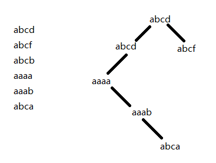
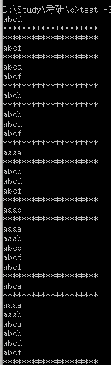
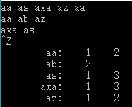

# Ch6 结构

### 6.1 结构的基本知识

~~~c
struct {...} x, y, z;
// 语法角度上与下相同
int x, y, z;
~~~

~~~c
struct point {
    int x;
    int y;
}
struct rect {
    struct point pt1;
    struct point pt2;
}

struct rect screen;

// 可以引用screen的成员项pt1的x坐标
screen.pt1.x
~~~

### 6.2 结构与函数

~~~c
// 通过x、y坐标构造一个点
struct point makepoint(int x, int y){
    struct point temp;
    temp.x = x;
    temp.y = y;
    return temp;
}
~~~

现在可以使用makepoint函数动态初始化任意结构

~~~c
struct rect screen;
struct point middle;
screen.pt1 = makepoint(0, 0);
screen.pt2 = makepoint(XMAX, YMAX);
middle = makepoint((screen.pt1.x + screen.pt2.x)/2,
                   (screen.pt1.y + screen.pt2.y)/2);
~~~

结构类型参数和其他类型的参数一样，通过值传递

~~~c

~~~

~~~c
// 如果点p在矩形r内，则返回1， 否则返回0
int ptinrect(struct point p, struct rect r){
    return p.x >= r.p1.x && p.x <= r.p2.x 
        && p.y >= r.p1.y && p.y <= r.p2.y;
}
~~~

~~~c
// 将矩形坐标规范化
# define min(a,b) ((a) < (b) ? (a) : (b))
# define max(a,b) ((a) > (b) ? (a) : (b))
struct rect canonrect(struct rect r){
    struct rect temp;
    temp.p1.x = min(r.p1.x, r.p2.x);
    temp.p1.x = max(r.p1.x, r.p2.x);
    temp.p1.y = min(r.p1.y, r.p2.y);
    temp.p1.y = max(r.p1.y, r.p2.y);
	return temp;
}
~~~

如果传递给函数的结构很大，使用指针方式的效率通常比复制整个结构的效率要高

~~~c
struct point *pp;
// pp指向一个point结构， *pp为该结构 (*pp).x和(*pp).y是结构成员

struct point origin;
pp = &origin;
printf("origin is (%d, %d)\n", (*pp).x, (*pp).y);
~~~

**“.”的优先级比“*”的优先级高**

**(\*pp).x, (\*pp).y 等价于 pp->x, pp->y**

**运算符. 和->都是从左至右结合的**

结构运算符“.”和“->” 用于函数调用的“()” 用于下标的“[]” 优先级最高，同操作数之间的结合也最紧密

~~~~c
struct {
    int len;
    char *str;
} *p;
~~~~

~~~c
++p->len // 增加len的值而不是增加p的值
*p->str // 指针str所指向对象的值
*p->str++ // 读取指针str指向对象的值，然后再将str加1
(*p->str)++ // 将指针str指向的对象的值加1
*p++->str // 先读取指针str指向对象的值，然后再将p加1
~~~

### 6.3 结构数组

统计输入中各个C语言关键字出现的次数

~~~c
#include <stdio.h>
#include <ctype.h>
#include <string.h>

#define MAXWORD 100
#define NKEYS (sizeof keytab / sizeof(struct key)) // keytab中的个数

struct key{
    char *word;
    int count;
} keytab[] = {
    { "auto", 0 },
    { "break", 0 },
    { "case", 0 },
    { "char", 0 },
    { "const", 0 },
    { "continue", 0 },
    { "default", 0 },
    { "unsigned", 0 },
    { "void", 0 },
    { "volatile", 0 },
    { "while", 0 }
}; // 关键字序列以升序存储在keytab中

int getword(char *, int);
int binsearch(char *word, struct key tab[], int n);

main(){
    int n;
    char word[MAXWORD];

    while(getword(word, MAXWORD) != EOF){
        if(isalpha(word[0]))
            if((n = binsearch(word, keytab, NKEYS)) >= 0)
                keytab[n].count++;
    }
    for(n=0; n<NKEYS; n++)
        if(keytab[n].count > 0)
            printf("%4d %s\n",keytab[n].count, keytab[n].word);
    return 0;
}

// 在tab[0]到tab[n-1]中查找单词
int binsearch(char *word, struct key tab[], int n){
    int cond;
    int low, high, mid;

    low = 0;
    high = n - 1;
    while(low <= high){
        mid = (low + high)/2;
        if((cond = strcmp(word, tab[mid].word)) < 0)
            high = mid -1;
        else if(cond > 0)
            low = mid + 1;
        else
            return mid;
    }
    return -1;
}

// 从输入中读取下一个单词或字符
int getword(char *word, int lim){
    int c, getch(void);
    void ungetch(int);
    char *w = word;

    while(isspace(c = getch()));
    if(c != EOF)
        *w++ = c;
    if(!isalpha(c)){
        *w = '\0';
        return c;
    }
    for(; --lim>0; w++)
        if(!isalnum(*w = getch())){ // 识别字母数字
            ungetch(*w);
            break;
        }
    *w = '\0';
    return word[0];
}

# define BUFSIZE 100

char buf[BUFSIZE]; // 用于ungetch()函数的缓冲区
int bufp = 0; // buf中下一个空闲位置

// 取一个字符（可能是压回的字符）
int getch(void){
    return (bufp > 0) ? buf[--bufp] : getchar();
}

// 把字符压回输入中
void ungetch(int c){
    if(bufp >= BUFSIZE)
        printf("ungetch: too many characters\n");
    else
        buf[bufp++] = c;
}
~~~

*注*

~~~c
#define NKEYS (sizeof keytab / sizeof(struct key))
~~~

也可写为

~~~c
#define NKEYS (sizeof keytab / sizeof keytab[0])
~~~

\#if语句不能使用sizeof因为预处理器不对类型名进行分析，但处理器并不计算、#define中的表达式，所以这样写合法

#### 6-1 *上诉getword函数不能正确处理下划线、字符串常量、注释及预处理控制器指令。请编写一个更完善的getword函数

~~~c
// 从输入中读取下一个单词或字符
int getword(char *word, int lim){
    int c, d, getch(void), comment(void);
    void ungetch(int);
    char *w = word;

    while(isspace(c = getch()));
    
    if(c != EOF)
        *w++ = c;
        
    // 处理下划线和与编译器控制指令    
    if(isalpha(c) || c=='_' || c=='#'){ // 第一个字符是字母数字下划线或# 
        for(; --lim>0; w++)
            if(!isalnum(*w = getch()) && *w != '_'){
                ungetch(*w);
                break;
            }
    }
    else if(c == '\'' || c == '\"'){ // 处理字符串常量
        for(; --lim>0; w++)
            if((*w = getch()) == '\\') /* 若出现\ 往后多读一个\，为了防止 \' 和 \" 的错误 */
                *++w = getch();
            else if(*w == c){
                w++;
                break;
            }
            else if(*w == EOF)
                break;
    }
    else if(c == '\\')
        if((d = getch()) == '*')
            c = comment();
        else 
            ungetch(d);
    *w = '\0';
    return c;
}

int comment(void){
    int c;
    while((c = getch()) != EOF)
        if(c == '*') // 一定是*后面紧跟/，即出现 */ 才算注释结束
            if((c = getch()) == '\\')
                break;
            else
                ungetch(c);
    return c;
}
~~~

### 6.4 指向结构的指针

~~~c
#include <stdio.h>
#include <ctype.h>
#include <string.h>

#define MAXWORD 100
#define NKEYS (sizeof keytab / sizeof(struct key)) // keytab中的个数

struct key{
    char *word;
    int count;
} keytab[] = {
    { "auto", 0 },
    { "break", 0 },
    { "case", 0 },
    { "char", 0 },
    { "const", 0 },
    { "continue", 0 },
    { "default", 0 },
    { "unsigned", 0 },
    { "void", 0 },
    { "volatile", 0 },
    { "while", 0 }
}; // 关键字序列以升序存储在keytab中

int getword(char *, int);
struct key *binsearch(char *, struct key *, int);

// 统计关键字的出现次数：采用指针方式的版本
main(){
    char word[MAXWORD];
    struct key *p;

    while(getword(word, MAXWORD) != EOF){
        if(isalpha(word[0]))
            if((p = binsearch(word, keytab, NKEYS)) != NULL)
                p->count++;
    }
    for(p=keytab; p<keytab+NKEYS; p++)
        if(p->count > 0)
            printf("%4d %s\n", p->count, p->word);
    return 0;
}

// 在tab[0]到tab[n-1]中查找与读入单词匹配的元素
struct key *binsearch(char *word, struct key *tab, int n){
    int cond;
    struct key *low = &tab[0]; // low初值指向表头元素的指针
    struct key *high = &tab[n]; // high初值指向表未元素后面一个元素的指针
    
    while(low <= high){
        mid = low + (high-low)/2; // 注 high-low得到之间的元素个数
        if((cond = strcmp(word, tab->word)) < 0)
            high = mid;
        else if(cond > 0)
            low = mid + 1;
        else
            return mid;
    }
    return NULL;
}
~~~

*注*

无法通过下列表达式计算中间元素的位置

~~~c
mid = (low + high) / 2; // 错误
~~~

因为两个指针之间的加法运算是非法的，但是**指针的减法运算却是合法的（指向同一个数组），high-low的值就是数组元素的个数**

&tab[-1] 和 &tab[n] 都超过了数组tab的范围，前者绝对非法，后者的间接引用也是非法的

**C语言的定义保证数组末尾之后的第一个元素（即&tab[n]）的指针算术运算可以正确执行**

结构的长度不一定等于各成员长度的和，因为不同的对象有不同的对齐要求，所以结构中可能会出现未命名的“空穴”（hole），假设char类型占用1个字节，int类型占用4个字节，则下列结构

~~~c
struct{
	char c;
    int i;
};
~~~

可能需要8个字节的存储空间，而不是5个字节，使用sizeof运算符可以返回正确的对象的长度

### 6.5 自引用结构

统计输入中所有单词的出现次数

~~~c
struct tnode{ // 树的节点
    char *word; // 指向单词的指针
    int count; // 单词出现的次数
    struct tnode *left; // 左子节点
    struct tnode *right; // 右子节点
};
~~~

两个结构互相引用

~~~c
struct t{
	struct s *p; // p指向一个s结构
};

struct s{
    struct t *q; // q指向一个t结构
}；
~~~

~~~c
#include <stdio.h>
#include <ctype.h>
#include <string.h>
#include <stdlib.h>

#define MAXWORD 100

struct tnode{ // 树的节点
    char *word; // 指向单词的指针
    int count; // 单词出现的次数
    struct tnode *left; // 左子节点
    struct tnode *right; // 右子节点
};

struct tnode *talloc(void);
char *strdup_(char *s);
struct tnode *addtree(struct tnode *, char *); // 将单词插入树中
void treeprint(struct tnode *);
int getword(char *, int); // 读入单词

// 单词出现频率的统计
main(){
    struct tnode *root;
    char word[MAXWORD];

    root = NULL;
    while(getword(word, MAXWORD) != EOF)
        if(isalpha(word[0]))
            root = addtree(root, word);
    treeprint(root);
    return 0;
}

// addtree在p的位置或p的下方增加一个节点
struct tnode *addtree(struct tnode *p, char *w){
    int cond;

    if(p == NULL){ // 该单词是一个新单词
        p = talloc(); // 创建一个新节点
        p->word = strdup(w);
        p->count = 1;
        p->left = p->right = NULL;
    }
    else if((cond = strcmp(w, p->word)) == 0) // 新单词与节点中的单词匹配
        p->count++;
    else if(cond < 0)
        p->left = addtree(p->left, w); // 新单词小于节点单词，进入左子树
    else
        p->right = addtree(p->right, w); // 新单词大于节点单词，进入右子树
    return p;
}

// 按顺序打印树p
void treeprint(struct tnode *p){
    if(p != NULL){
        treeprint(p->left);
        printf("%4d %s\n", p->count, p->word);
        treeprint(p->right);
    }
}

// 创建一个tnode
struct tnode *talloc(void){
    return (struct tnode *) malloc(sizeof(struct tnode));
}

// 把通过其参数传入的字符串复制到某个安全的位置
char *strdup_(char *s){
    char *p;
    p = (char *)malloc(strlen(s) + 1);
    if(p != NULL)
        strcpy(p, s);
    return p;
}

// 从输入中读取下一个单词或字符
int getword(char *word, int lim){
    int c, getch(void);
    void ungetch(int);
    char *w = word;

    while(isspace(c = getch()));
    if(c != EOF)
        *w++ = c;
    if(!isalpha(c)){
        *w = '\0';
        return c;
    }
    for(; --lim>0; w++)
        if(!isalnum(*w = getch())){ // 识别字母数字
            ungetch(*w);
            break;
        }
    *w = '\0';
    return word[0];
}

# define BUFSIZE 100

char buf[BUFSIZE]; // 用于ungetch()函数的缓冲区
int bufp = 0; // buf中下一个空闲位置

// 取一个字符（可能是压回的字符）
int getch(void){
    return (bufp > 0) ? buf[--bufp] : getchar();
}

// 把字符压回输入中
void ungetch(int c){
    if(bufp >= BUFSIZE)
        printf("ungetch: too many characters\n");
    else
        buf[bufp++] = c;
}
~~~

#### 6-2 *用以读入一个C语言程序，并按字母表顺序分组打印变量名，要求每一组内各变量名的前6个字符相同，其余字符不同。字符串和注释中的单词不予考虑。请将6作为一个可在命令行中设定的参数。

~~~c
#include <stdio.h>
#include <ctype.h>
#include <string.h>
#include <stdlib.h>

#define MAXWORD 100
#define YES 1
#define NO 0

struct tnode{
    char *word;
    int match;
    struct tnode *left;
    struct tnode *right;
};

struct tnode *addtreex(struct tnode *, char *, int, int *);
void treeprint(struct tnode *);
int getword(char *, int);
// 用以读入一个C语言程序，并按字母表顺序分组打印变量名
// 要求每一组内各变量名的前6个字符相同，其余字符不同。
// 字符串和注释中的单词不予考虑。请将6作为一个可在命令行中设定的参数。
main(int argc, char *argv[]){
    struct tnode *root;
    char word[MAXWORD];
    int found = NO;
    int num;

    num = (--argc && (*++argv)[0] == '-') ? atoi(argv[0]+1) : 6; // 从命令行中获取参数，默认为6
    root = NULL;
    while(getword(word, MAXWORD) != EOF){
        if(isalpha(word[0]) && strlen(word) >= num) //如果字母长度超过设定长度，增加新节点
            root = addtreex(root, word, num, &found); // 传found的地址
        found = NO; // 每增加节点后初始化found的值为NO
        printf("********************\n");
        treeprint(root);
        printf("********************");
    }
    treeprint(root);
    return 0;
}

struct tnode *talloc(void);
char *strdup_(char *s);
int compare(char *, struct tnode *, int, int *);

struct tnode *addtreex(struct tnode *p, char *w, int num, int *found){
    int cond;

    if(p == NULL){
        p = talloc();
        p->word = strdup_(w);
        p->match = *found;
        p->left = p->right = NULL;
    }
    else if((cond = compare(w, p, num, found)) < 0) // 新加入单词小于根节点单词，将新单词以其左节点为根，加入树中
        p->left = addtreex(p->left, w, num, found);
    else if(cond > 0)
        p->right = addtreex(p->right, w, num, found);
    return p;
}

int compare(char *s, struct tnode *p, int num, int *found){
    int i;
    char *t = p->word;

    for(i=0; *s == *t; i++, s++, t++) // 新单词与节点单词相同，是已经出现过的单词
        if(*s == '\0')
        return 0;
    if(i >= num){        // 前num个字符相匹配，在一个组中，
        *found = YES;    //将变量树中的单词相对应的*found和p->match置YES
        p->match = YES;
    }
    return *s - *t; // 返回新单词和节点单词的大小关系
}

// 按顺序打印树p
void treeprint(struct tnode *p){
    if(p != NULL){
        treeprint(p->left);
        if(p->match)
            printf("%s\n", p->word);
        treeprint(p->right);
    }
}

// 创建一个tnode
struct tnode *talloc(void){
    return (struct tnode *) malloc(sizeof(struct tnode));
}

// 把通过其参数传入的字符串复制到某个安全的位置
char *strdup_(char *s){
    char *p;
    p = (char *)malloc(strlen(s) + 1);
    if(p != NULL)
        strcpy(p, s);
    return p;
}

void ungetch(int);
int getch(void);
// 从输入中读取下一个单词或字符
int getword(char *word, int lim){
    int c, d, comment(void);

    char *w = word;

    while(isspace(c = getch()));

    if(c != EOF)
        *w++ = c;

    // 处理下划线和与编译器控制指令
    if(isalpha(c) || c=='_' || c=='#'){ // 第一个字符是字母数字下划线或#
        for(; --lim>0; w++)
            if(!isalnum(*w = getch()) && *w != '_'){ // 不再是标识符
                ungetch(*w);
                break;
            }
    }
    else if(c == '\'' || c == '\"'){ // 处理字符串常量
        for(; --lim>0; w++)
            if((*w = getch()) == '\\') /* 若出现\ 往后多读一个\，为了防止 \' 和 \" 的错误 */
                *++w = getch();
            else if(*w == c){ // 遇到匹配的 ' 或 "
                w++;
                break;
            }
            else if(*w == EOF)
                break;
    }
    else if(c == '\\')
        if((d = getch()) == '*')
            c = comment(); // c中存放注释后紧跟的字符
        else
            ungetch(d);
    *w = '\0';
    return c;
}

int comment(void){
    int c;
    while((c = getch()) != EOF)
        if(c == '*') // 一定是*后面紧跟/，即出现 */ 才算注释结束
            if((c = getch()) == '\\')
                break;
            else
                ungetch(c);
    return c;
}

# define BUFSIZE 100

char buf[BUFSIZE]; // 用于ungetch()函数的缓冲区
int bufp = 0; // buf中下一个空闲位置

// 取一个字符（可能是压回的字符）
int getch(void){
    return (bufp > 0) ? buf[--bufp] : getchar();
}

// 把字符压回输入中
void ungetch(int c){
    if(bufp >= BUFSIZE)
        printf("ungetch: too many characters\n");
    else
        buf[bufp++] = c;
}
~~~

输出结果：

#### 6-3 *编写一个交叉引用程序，打印文档中所有单词的列表，并且每个单词还有一个列表，记录出现过的该单词的行号。对the、and等非实义单词不予考虑。

~~~c
#include <stdio.h>
#include <ctype.h>
#include <string.h>
#include <stdlib.h>

#define MAXWORD 100

struct linklist{ // 链表存行号
    int lnum; // 行号
    struct linklist *ptr; // 连接的下一项
};

struct tnode{
    char *word;
    struct linklist *lines;
    struct tnode *left;
    struct tnode *right;
};

struct tnode *addtreex(struct tnode *, char *, int);
void treeprint(struct tnode *);
int getword(char *, int);
int noiseword(char *);

// 编写一个交叉引用程序，打印文档中所有单词的列表，
// 并且每个单词还有一个列表，记录出现过的该单词的行号。
// 对the、and等非实义单词不予考虑。
main(){
    struct tnode *root;
    char word[MAXWORD];
    int linenum = 1; // 行号

    root = NULL;
    while(getword(word, MAXWORD) != EOF){
        if(isalpha(word[0]) && noiseword(word) == -1) // 如果标识符不是非实义单词，增加新节点
            root = addtreex(root, word, linenum);
        else if(word[0] == '\n')
            linenum++;
    }
    treeprint(root);
    return 0;
}

struct tnode *talloc(void);
char *strdup_(char *s);
struct linklist *lalloc(void);
void addIn(struct tnode *, int);

struct tnode *addtreex(struct tnode *p, char *w, int linenum){
    int cond;

    if(p == NULL){
        p = talloc();
        p->word = strdup_(w);

        p->lines = lalloc();
        p->lines->lnum = linenum;
        p->lines->ptr = NULL;

        p->left = p->right = NULL;
    }
    else if((cond = strcmp(w, p->word)) == 0) // 新输入的单词，对存行号的链表进行处理
        addIn(p, linenum);
    else if(cond > 0)
        p->right = addtreex(p->right, w, linenum);
    else
        p->left = addtreex(p->left, w, linenum);
    return p;
}

void addIn(struct tnode *p, int linenum){
    struct linklist *temp;

    temp = p->lines; // 该节点中存的链表
    while(temp->ptr != NULL && temp->lnum != linenum) // 出现未出现过的行号，找到链表中最后一位
        temp = temp->ptr;
    if(temp->lnum != linenum){
        temp->ptr = lalloc(); // 往后创建一个新的链表节点
        temp->ptr->ptr = NULL; // 链表指向的下一个节点为空
        temp->ptr->lnum = linenum; // 链表中的内容为当前传入的行号
    }
}

// 按顺序打印树p
void treeprint(struct tnode *p){
    struct linklist *temp;
    if(p != NULL){
        treeprint(p->left);
        printf("%10s: ",p->word);
        for(temp=p->lines; temp!=NULL; temp=temp->ptr)
            printf("%4d ", temp->lnum);
        printf("\n");
        treeprint(p->right);
    }
}

// 创建一个tnode
struct tnode *talloc(void){
    return (struct tnode *) malloc(sizeof(struct tnode));
}

// 把通过其参数传入的字符串复制到某个安全的位置
char *strdup_(char *s){
    char *p;
    p = (char *)malloc(strlen(s) + 1);
    if(p != NULL)
        strcpy(p, s);
    return p;
}

// 创建一个链表节点
struct linklist *lalloc(void){
    return (struct linklist *)malloc(sizeof(struct linklist));
}

//
int noiseword(char *w){
    static char *nw[] = {
        "a",
        "an",
        "are",
        "in",
        "is",
        "of",
        "or",
        "that",
        "the",
        "this",
        "to"
    };
    int cond, mid;
    int low = 0;
    int high = sizeof(nw) / sizeof(char *) - 1; // 指向nw的最后一位

    while(low <= high){ // 折半查找单词
        mid = (low + high) / 2;
        if((cond = strcmp(w, nw[mid])) < 0)
            high = mid - 1;
        else if(cond > 0)
            low = mid + 1;
        else
            return mid;
    }
    return -1; // 单词不在这些无实义的单词中
}

void ungetch(int);
int getch(void);

// 从输入中读取下一个单词或字符
int getword(char *word, int lim){
    int c, d, comment(void);

    char *w = word;

    while(isspace(c = getch()) && c != '\n'); // 为了记录行号需要能读'\n'

    if(c != EOF)
        *w++ = c;

    // 处理下划线和与编译器控制指令
    if(isalpha(c) || c=='_' || c=='#'){ // 第一个字符是字母数字下划线或#
        for(; --lim>0; w++)
            if(!isalnum(*w = getch()) && *w != '_'){ // 不再是标识符
                ungetch(*w);
                break;
            }
    }
    else if(c == '\'' || c == '\"'){ // 处理字符串常量
        for(; --lim>0; w++)
            if((*w = getch()) == '\\') /* 若出现\ 往后多读一个\，为了防止 \' 和 \" 的错误 */
                *++w = getch();
            else if(*w == c){ // 遇到匹配的 ' 或 "
                w++;
                break;
            }
            else if(*w == EOF)
                break;
    }
    else if(c == '\\')
        if((d = getch()) == '*')
            c = comment(); // c中存放注释后紧跟的字符
        else
            ungetch(d);
    *w = '\0';
    return c;
}

int comment(void){
    int c;
    while((c = getch()) != EOF)
        if(c == '*') // 一定是*后面紧跟/，即出现 */ 才算注释结束
            if((c = getch()) == '\\')
                break;
            else
                ungetch(c);
    return c;
}

# define BUFSIZE 100

char buf[BUFSIZE]; // 用于ungetch()函数的缓冲区
int bufp = 0; // buf中下一个空闲位置

// 取一个字符（可能是压回的字符）
int getch(void){
    return (bufp > 0) ? buf[--bufp] : getchar();
}

// 把字符压回输入中
void ungetch(int c){
    if(bufp >= BUFSIZE)
        printf("ungetch: too many characters\n");
    else
        buf[bufp++] = c;
}
~~~

#### 6-4 *根据单词的出现频率按降序打印输入的各个不同单词，并在每个单词的前面标上它的出现次数（希尔排序还很懵懂）

~~~c
#include <stdio.h>
#include <ctype.h>
#include <string.h>
#include <stdlib.h>

#define MAXWORD 100
#define NDISTINCT 1000 // 对不同单词的最大数目限制

struct tnode{
    char *word;
    int count;
    struct tnode *left;
    struct tnode *right;
};

struct tnode *addtree(struct tnode *, char *);
int getword(char *, int);
void sortlist(void);
void treestore(struct tnode *);

struct tnode *list[NDISTINCT]; // 指针数组，其中的每个指针都指向一个tnode类型的结构
int ntn = 0; // 保存树节点的个数

// 根据单词的出现频率按降序打印输入的各个不同单词，并在每个单词的前面标上它的出现次数
main(){
    struct tnode *root;
    char word[MAXWORD];
    int i;

    root = NULL;
    while(getword(word, MAXWORD) != EOF){
        if(isalpha(word[0]))
            root = addtree(root, word);
    }
    treestore(root); // 将list中的指针指向树的节点
    sortlist(); // 排序
    for(i=0; i<ntn; i++)
        printf("%2d: %20s\n", list[i]->count, list[i]->word);
    return 0;
}

void treestore(struct tnode *p){
    if(p != NULL){
        treestore(p->left);
        if(ntn < NDISTINCT)
            list[ntn++] = p;
        treestore(p->right);
    }
}

void sortlist(){ // 希尔排序
    int gap, i, j;
    struct tnode *temp;
    for(gap=ntn/2; gap>0; gap/=2){
        for(i=gap; i<ntn; i++){
            for(j=i-gap; j>=0; j-=gap){
                if((list[j]->count) >= (list[j+gap]->count))
                    break;
                temp = list[j];
                list[j] = list[j+gap];
                list[j+gap] = temp;
            }
        }
    }
}

char *strdup_(char *s);
struct tnode *talloc(void);
// addtree在p的位置或p的下方增加一个节点
struct tnode *addtree(struct tnode *p, char *w){
    int cond;

    if(p == NULL){ // 该单词是一个新单词
        p = talloc(); // 创建一个新节点
        p->word = strdup(w);
        p->count = 1;
        p->left = p->right = NULL;
    }
    else if((cond = strcmp(w, p->word)) == 0) // 新单词与节点中的单词匹配
        p->count++;
    else if(cond < 0)
        p->left = addtree(p->left, w); // 新单词小于节点单词，进入左子树
    else
        p->right = addtree(p->right, w); // 新单词大于节点单词，进入右子树
    return p;
}

// 创建一个tnode
struct tnode *talloc(void){
    return (struct tnode *) malloc(sizeof(struct tnode));
}

// 把通过其参数传入的字符串复制到某个安全的位置
char *strdup_(char *s){
    char *p;
    p = (char *)malloc(strlen(s) + 1);
    if(p != NULL)
        strcpy(p, s);
    return p;
}

void ungetch(int);
int getch(void);

// 从输入中读取下一个单词或字符
int getword(char *word, int lim){
    int c, d, comment(void);

    char *w = word;

    while(isspace(c = getch()));

    if(c != EOF)
        *w++ = c;

    // 处理下划线和与编译器控制指令
    if(isalpha(c) || c=='_' || c=='#'){ // 第一个字符是字母数字下划线或#
        for(; --lim>0; w++)
            if(!isalnum(*w = getch()) && *w != '_'){ // 不再是标识符
                ungetch(*w);
                break;
            }
    }
    else if(c == '\'' || c == '\"'){ // 处理字符串常量
        for(; --lim>0; w++)
            if((*w = getch()) == '\\') /* 若出现\ 往后多读一个\，为了防止 \' 和 \" 的错误 */
                *++w = getch();
            else if(*w == c){ // 遇到匹配的 ' 或 "
                w++;
                break;
            }
            else if(*w == EOF)
                break;
    }
    else if(c == '\\')
        if((d = getch()) == '*')
            c = comment(); // c中存放注释后紧跟的字符
        else
            ungetch(d);
    *w = '\0';
    return c;
}

int comment(void){
    int c;
    while((c = getch()) != EOF)
        if(c == '*') // 一定是*后面紧跟/，即出现 */ 才算注释结束
            if((c = getch()) == '\\')
                break;
            else
                ungetch(c);
    return c;
}

# define BUFSIZE 100

char buf[BUFSIZE]; // 用于ungetch()函数的缓冲区
int bufp = 0; // buf中下一个空闲位置

// 取一个字符（可能是压回的字符）
int getch(void){
    return (bufp > 0) ? buf[--bufp] : getchar();
}

// 把字符压回输入中
void ungetch(int c){
    if(bufp >= BUFSIZE)
        printf("ungetch: too many characters\n");
    else
        buf[bufp++] = c;
}
~~~

### 6.6表查找

散列查找的方式，将输入的名字转换为一个小的非负整数，该整数随后作为一个指针数组的下标

数组的每个元素指向某个链表的表头 （*所以可能不同名字得到相同hash值放在同一列表中*）

链表中的各个块用于描述具有该散列值的名字

链表中块的结构：

~~~c
struct nlist{ // 链表项
    struct nlist *next; // 链表中的下一表项
    char *name; // 定义的名字
    char *defn; // 替换文本
}
~~~

相应指针数组定义：

~~~c
#define HASHSIZE 101
static struct nlist *hashtab[HASHSIZE]; // 指针表
~~~

散列函数 为字符串s生成散列值，散列过程生成在数组hashtab中执行查找的起始下标

~~~c
unsigned hash(char *s){ // 无符号保证非负
    unsigned hashval;
    
    for(hashval=0; *s!='\0'; s++)
        hashval = *s + 31 * hashval;
    return hashval % HASHSIZE;
}
~~~

lookup: 在hashtab中查找s，发现表项已存在返回指向该表项的指针否则返回NULL

~~~c
struct nlist *lookup(char *s){
    struct nlist *p;
    
    for(np=hashtab[hash(s)]; np!=NULL; np=np->next) // 遍历链表
        if(strcmp(s, np->name) == 0)
            return np;
    return NULL;
} 
~~~

其中

~~~c
for(np=head]; np!=NULL; np=np->next) // 遍历链表的标准方法
~~~

install：借助lookup判断待加入的名字是否存在，若存在用新的定义取而代之，否则创建一个新的表项

~~~c
// 将(name, defn)加入到hashtab中
struct nlist *install(char *name, char *defn){
    struct nlist *np;
    unsigned hashval;
    
    if((np = lookup(name)) == NULL){ // 未找到
        np = (struct nlist *)malloc(sizeof(*np));
        if(np == NULL || (np->name = strdup(name)) == NULL)
            return NULL;
        hashval = hash(name);
        np->next = hashtab[hashval];
        hashtab[hashval] = np;
    }
    else // 已存在
        free((void*) np->defn); // 释放前一个defn
    if(np->defn = strdup(defn) == NULL) // 新定义取而代之，如果为空返回空
        return NULL;
    return np;
}
~~~

#### 6-5 编写函数undef，它将从由lookup和install维护的表中删除一个变量名及其定义

~~~c
void undef(char *s){
    int h;
    struct nlist *prev, *np;
    
    prev = NULL;
    h = hash(s);
    for(np=hashtab(h); np!=NULL; np=np->next){ // 在表中查找字符串s
        if(strcmp(s, np->name) == 0)
            break;
        prev = np; // prev指向np出现前的那个数据项
    } // 如果表中没有s，则最后np指向NULL跳出
    if(np != NULL){
        if(prev == NULL) // np是以hashtab[h]开头的那个链表的第一个元素
            hashab[h] = np->next;
        else
            prev->next = np->next;
        free((void *)np->name);
        free((void *)np->defn);
        free((void *)np);
    }
}
~~~

#### 6-6 *以本节介绍的函数为基础，编写一个适合C语言程序使用的#define处理器的简单版本（即无参数的情况）。你会发现getch和ungetch函数非常有用。

~~~c
// 以本节介绍的函数为基础，
//编写一个适合C语言程序使用的#define处理器的简单版本（即无参数的情况）。
//你会发现getch和ungetch函数非常有用。
#include <stdio.h>
#include <ctype.h>
#include <string.h>

#define MAXWORD 100

struct nlist{
    struct nlist *next;
    char *name;
    char *defn;
};

void error(int, char *);
int getch(void);
void getdef(void);
int getword(char *, int);
struct nlist *install(char *, char *);
struct nlist *lookup(char *);
void skipblanks(void);
void undef(char *);
void ungetch(int);
void ungets(char *);

#define HASHSIZE 101
static struct nlist *hashtab[HASHSIZE]; // 指针表

unsigned hash(char *s){ // 无符号保证非负
    unsigned hashval;

    for(hashval=0; *s!='\0'; s++)
        hashval = *s + 31 * hashval;
    return hashval % HASHSIZE;
}

main(){
    char w[MAXWORD];
    struct nlist *p;

    while(getword(w, MAXWORD) != EOF){
        if(strcmp(w, "#") == 0)
            getdef();
        else if(!isalpha(w[0])) // 非可定义的标识符
            printf("%s", w);
        else if((p = lookup(w)) == NULL) // 未定义
            printf("%s", w);
        else                  // 该单词确实有一个配对的定义
            ungets(p->defn);  // 把他们重新压回输入流
    }
    return 0;
}

struct nlist *lookup(char *s){
    struct nlist *np;

    for(np=hashtab[hash(s)]; np!=NULL; np=np->next) // 遍历链表
        if(strcmp(s, np->name) == 0)
            return np;
    return NULL;
}

// 将(name, defn)加入到hashtab中
struct nlist *install(char *name, char *defn){
    struct nlist *np;
    unsigned hashval;

    if((np = lookup(name)) == NULL){ // 未找到
        np = (struct nlist *)malloc(sizeof(*np));
        if(np == NULL || (np->name = strdup(name)) == NULL)
            return NULL;
        hashval = hash(name);
        np->next = hashtab[hashval];
        hashtab[hashval] = np;
    }
    else // 已存在
        free((void*) np->defn); // 释放前一个defn
    if(np->defn = strdup(defn) == NULL) // 新定义取而代之，如果为空返回空
        return NULL;
    return np;
}

void undef(char *s){
    int h;
    struct nlist *prev, *np;

    prev = NULL;
    h = hash(s);
    for(np=hashtab[h]; np!=NULL; np=np->next){ // 在表中查找字符串s
        if(strcmp(s, np->name) == 0)
            break;
        prev = np; // prev指向np出现前的那个数据项
    } // 如果表中没有s，则最后np指向NULL跳出
    if(np != NULL){
        if(prev == NULL) // np是以hashtab[h]开头的那个链表的第一个元素
            hashtab[h] = np->next;
        else
            prev->next = np->next;
        free((void *)np->name);
        free((void *)np->defn);
        free((void *)np);
    }
}

void getdef(){
    int c, i;
    char dir[MAXWORD]; // 存放define或undef指令 或出错指令
    char name[MAXWORD]; // 存放变量名
    char def[MAXWORD]; // 存放变量名定义

    skipblanks();
    if(!isalpha(getword(dir, MAXWORD)))
        error(dir[0], "getdef: expecting a directive after #");
    else if(strcmp(dir, "define") == 0){
        skipblanks();
        if(!isalpha(getword(name, MAXWORD)))
            error(name[0], "getdef: non-alpha - name expected");
        else{
            skipblanks();
            for(i=0; i<MAXWORD-1; i++)
                if((def[i] = getch()) == EOF || def[i] == '\n')
                   break;
            def[i] = '\0';
            if(i <= 0)
                error('\n', "getdef; incomplete define");
            else
                install(name, def);
        }
    }
    else if(strcmp(dir, "undef") == 0){
        skipblanks();
        if(!isalpha(getword(name, MAXWORD)))
            error(name[0], "getdef: non-alpha in undef");
        else
            undef(name);
    }
    else
        error(dir[0], "getdef: expecting a directive after #");
}

void error(int c, char *s){
    printf("error: %s\n", s);
    while(c != EOF && c != '\n')
        c = getch();
}

void skipblanks(void){
    int c;

    while((c = getch()) == ' ' || c == '\t');
    ungetch(c);
}

// 从输入中读取下一个单词或字符
int getword(char *word, int lim){
    int c, d, comment(void);

    char *w = word;

    while(isspace(c = getch()) && c!=' ');

    if(c != EOF)
        *w++ = c;

    // 处理下划线和与编译器控制指令
    if(isalpha(c) || c=='_' || c=='#'){ // 第一个字符是字母数字下划线或#
        for(; --lim>0; w++)
            if(!isalnum(*w = getch()) && *w != '_'){ // 不再是标识符
                ungetch(*w);
                break;
            }
    }
    else if(c == '\'' || c == '\"'){ // 处理字符串常量
        for(; --lim>0; w++)
            if((*w = getch()) == '\\') /* 若出现\ 往后多读一个\，为了防止 \' 和 \" 的错误 */
                *++w = getch();
            else if(*w == c){ // 遇到匹配的 ' 或 "
                w++;
                break;
            }
            else if(*w == EOF)
                break;
    }
    else if(c == '\\')
        if((d = getch()) == '*')
            c = comment(); // c中存放注释后紧跟的字符
        else
            ungetch(d);
    *w = '\0';
    return c;
}

int comment(void){
    int c;
    while((c = getch()) != EOF)
        if(c == '*') // 一定是*后面紧跟/，即出现 */ 才算注释结束
            if((c = getch()) == '\\')
                break;
            else
                ungetch(c);
    return c;
}

# define BUFSIZE 100

char buf[BUFSIZE]; // 用于ungetch()函数的缓冲区
int bufp = 0; // buf中下一个空闲位置

// 取一个字符（可能是压回的字符）
int getch(void){
    return (bufp > 0) ? buf[--bufp] : getchar();
}

// 把字符压回输入中
void ungetch(int c){
    if(bufp >= BUFSIZE)
        printf("ungetch: too many characters\n");
    else
        buf[bufp++] = c;
}

void ungets(char s[]){
    int len, i;
    len = strlen(s);
    while(len>0)
        ungetch(s[--len]);
}
~~~

其中函数getdef能够处理下面两种指令

~~~c
#define name definition
#undef name
~~~

name是由字母或数字构成的变量名

definition是这个变量名的定义

### 6.7 类型定义（typedef）

**以大写字母作为typedef定义的类型名的首字母以示区别**

~~~c
typedef int Length;
~~~

将Length定义为与int具有同等意义的名字，可用来类型声明、类型转换等，如

~~~c
Length len, maxlen;
Length *lengths[];
~~~

~~~c
typedef char *String; // 将String定义为与char*或字符指针同义

String p, lineptr[MAXLINES], alloc(int);
int strcmp(String, String);
p = (Sting)malloc(100);
~~~

~~~c
typedef struct tnode *Treeptr;

typedef struct tnode{
    char *word;
    int count;
    Treeptr left;
    Treeptr right;
} Treenode;
~~~

上述类型定义创建了两个新类型关键字：Treenode（一个结构） 和 Treeptr（一个指向该结构的指针）

这样函数talloc可修改为

~~~c
Treeptr talloc(void){
    return (Treeptr)malloc(sizeof(Treenode));
}
~~~

typedef类似于#define语句，但由于typedef由**编译器**解释，所以文本替换能力超过预处理器的能力

~~~c
typedef int (*PFI)(char *, char *);
~~~

PFI是一个指向函数的指针，该函数具有两个char *类型的参数，返回类型为int

第5章排序程序可写为 

~~~c
PFI strcmp, numcmp;
~~~

### 6.8 联合

目的：一个变量可以合法地保存多种数据类型中的任何一种类型的对象

~~~c
union u_tag{
    int ival;
    float fval;
    char *sval;
} u;
~~~

这些类型中的任何一种类型的对象都可以赋给u

用变量utype跟踪保存在u中的当前数据类型

~~~c
if(utype == INT)
	printf("%d\n", u.ival);
else if(utype == FLOAT)
	printf("%d\n", u.fval);
else if(utype == STRING)
	printf("%d\n", u.sval);
else
	printf("bad type %d in utype\n", utype);
~~~

~~~c
struct{
    char *name;
    int flag;
    int utype;
    union{
        int ival;
    	float fval;
    	char *sval; 
    } u;
} symtab[NSYM];

// 引用其成员ival
symtab[i].u.ival;
// 引用字符串sval的第一个字符
*symtab[i].u.sval;
symtab[i].u.sval[0];
~~~

联合只能用其**第一个成员类型的值**进行初始化

### 6.9 位字段

定义相关位置的屏蔽码，如

~~~c
#define KEYWORD 01
#define EXTERNAL 02
#define STATIC 04
~~~

或

~~~c
enum{ KEYWORD = 01, EXTERNAL = 02, STATIC = 04};
~~~

~~~c
flags |= EXTERNAL | STATIC; // 将flags中的EXTERNAL和STATIC位置为1
flags &= -(EXTERNAL | STATIC); // 将flags中的EXTERNAL和STATIC位置为0
~~~

上诉符号表的多个#define语句可由下列3个**字段的定义**替代

~~~c
struct{
    unsigned int is_keyword : 1;
    unsigned int is_extern : 1;
    unsigned int is_static : 1;
} flags;

flag.is_extern = flag.is_static = 1; // 将is_extern和is_static位置为1
~~~

