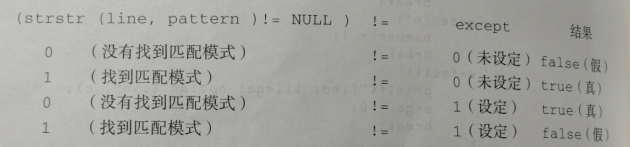
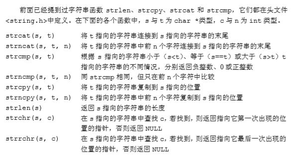
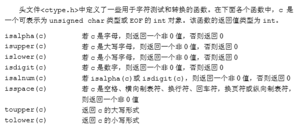
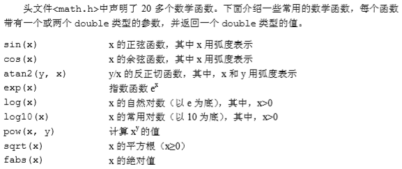

# Ch7 输入与输出

### 7.1标准输入/输出

#### 7-1 根据程序自身被调用时存放在argv[0]中的名字，实现将大写字母转换为小写字母或将小写字母转换为大写字母的功能

~~~c
// 根据程序自身被调用时存放在argv[0]中的名字，
// 实现将大写字母转换为小写字母或将小写字母转换为大写字母的功能
#include <stdio.h>
#include <ctype.h>
#include <string.h>

main(int argc, char *argv[]){
    int c;
    if(strcmp(argv[0], "lower") == 0)
        while((c = getchar()) != EOF)
            putchar(tolower(c));
    else
        while((c = getchar()) != EOF)
            putchar(toupper(c));
    return 0;
}
~~~

### 7.2 格式化输出——printf函数

~~~c
int printf(char *format, arg1, arg2, ...)
~~~

**每个转换说明都是由一个%开始，并以一个转换字符结束**


~~~c
int sprintf(char *string, char *format, arg1, arg2, ...)
~~~

sprintf可将结果放到string中

#### 7-2 *以合理的方式打印任何输入。该程序至少能够根据用户的习惯以八进制或十六进制打印非图形字符，并截断长文本行

~~~c
#include <stdio.h>
#include <ctype.h>
#define MAXLINE 100
#define OCTLEN 6
// 以合理的方式打印任何输入。该程序至少能够根据用户的习惯以八进制或十六进制打印非图形字符，并截断长文本行
main(){
    int c, pos;
    int inc(int pos, int n);

    pos = 0;
    while((c = getchar()) != EOF)
        if(iscntrl(c) || c == ' '){ // iscntrl：寻找非显示字符，删除控制符和普通控制字符，空格										  也被看做一个非显示字符
            pos = inc(pos, OCTLEN); // 非显示字符将打印为长度为OCTLEN个字符的八进制数字
            printf(" \\%03o ", c);
            if(c == '\n'){
                pos = 0;
                putchar('\n');
            }
        }
        else{ // 正常字符
            pos = inc(pos, 1);
            putchar(c);
        }
    return 0;
}

int inc(int pos, int n){
    if(pos + n < MAXLINE)
        return pos+n;
    else{
        putchar('\n');
        return n;
    }
}
~~~


iscntrl：寻找非显示字符，即删除控制符和普通控制字符，空格也被看做一个非显示字符

### 7.3 变长参数表

~~~c
int printf(char *fmt, ...)
~~~

**省略号表示参数表中的参数的数量和类型是可变的，只能出现在参数表的尾部**

~~~c
#include <stdarg.h>

// 带有可变参数表的简化的printf函数
void minprintf(char *fmt, ...){
    va_list ap; // 依次指向每个无名参数
    char *p, *sval;
    int ival;
    double dval;

    va_start(ap, fmt); // 将ap指向第一个无名参数
    for(p=fmt; *p; p++){
        if(*p != '%'){
            putchar(*p);
            continue;
        }
        switch(*++p){
        case 'd':
            ival = va_arg(ap, int); // 返回一个参数，并将ap指向下一个指针
            printf("%d", ival);
            break;
        case 'f':
            dval = va_arg(ap, double);
            printf("%f", dval);
            break;
        case 's':
            for(sval=va_arg(ap, char*); *sval; sval++)
                putchar(*sval);
            break;
        default:
            putchar(*p);
            break;
        }
    }
    va_end(ap); // 结束清理
}

int fun(){
    return 0;
}

main(){
    minprintf("%d, %f, %s, %d\n",1, 1.1, "aaaaa", fun());
    return 0;
}
~~~

####7-3 改写minprintf函数，使它能完成printf函数的更多功能

~~~c
#include <stdarg.h>
#include <ctype.h>
#include <stdio.h>
#define LOCALFMT 100

// 带有可变参数表的简化的printf函数
void minprintf(char *fmt, ...){
    va_list ap; // 依次指向每个无名参数
    char *p, *sval;
    char localfmt[LOCALFMT];
    int i, ival;
    double dval;
    unsigned uval;

    va_start(ap, fmt); // 将ap指向第一个无名参数
    for(p=fmt; *p; p++){
        if(*p != '%'){
            putchar(*p);
            continue;
        }
        i = 0;
        localfmt[i++] = '%';
        while(*(p+1) && !isalpha(*(p+1))) // 为处理转换说明做准备，即处理格式参数
            localfmt[i++] = *++p;
        localfmt[i++] = *(p+1);
        localfmt[i] = '\0';
        switch(*++p){
        case 'd':
        case 'i':
            ival = va_arg(ap, int); // 返回一个参数，并将ap指向下一个指针
            printf(localfmt, ival);
            break;
        case 'f':
            dval = va_arg(ap, double);
            printf(localfmt, dval);
            break;
        case 's':
            sval = va_arg(ap, char*);
            printf(localfmt, sval);
            break;
        case 'x':
        case 'X':
        case 'u':
        case 'o':
            uval = va_arg(ap, unsigned);
            printf(localfmt, uval);
            break;
        default:
            printf(localfmt);
            break;
        }
    }
    va_end(ap); // 结束清理
}

int fun(){
    return 0;
}

main(){
    minprintf("%-5d, %f, %s, %d\n",1, 1.1, "aaaaa", fun());
    return 0;
}
~~~

### 7.4 格式化输入——scanf函数

从标准输入中读取字符序列，按照format中的格式说明对字符序列进行解释，并把结果保存到其余的参数中，且其余的参数必须是指针，用于指定经格式转换后的相应输入保存的位置

~~~c
int sscanf(char *string, char *format, arg1, arg2...)
// 按照格式参数format中规定的格式扫描字符串string并把结果分别保存到arg1、arg2...这些参数中
~~~

~~~c
#include <stdio.h>

main(){
    double sum, v;

    sum = 0;
    while(scanf("%lf", &v) == 1)
        printf("\t%.2f\n", sum += v);
    return 0;
}
~~~


可读取mm/dd/yy格式的数据

~~~c
int day, month, year;
scanf("%d/%d/%d", &month, &day, &year);
~~~

scanf函数忽略格式串中的空格和制表符

如果要读取格式不固定的输入，最好每次读入一行然后再用sscanf将合适的格式分离出来读入

~~~c
while(getline(line, sizeof(line)) > 0){
    if(sscanf(line, "%d %s %d", &day, monthname, &year) == 3)
        printf("vaild: %s\n", line);
    else if(sscanf(line, "%d/%d/%d", &month, &day, &year) == 3)
        printf("vaild: %s\n", line);
    else
        printf("invaild: %s\n", line);   
}
~~~

#### 7-4 类似于minprintf，编写scanf函数的一个简化版本

```c
#include <sdio.h>
#include <stdarg.h>
#include <ctype.h>

#define LOCALFMT 100

void minscanf(char *fmt, ...){
    va_list ap; // 依次指向每个无名参数
    char *p, *sval;
    char localfmt[LOCALFMT];
    int c, i, *ival;
    unsigned *uval;
    double *dval;

    i = 0;
    va_start(ap, fmt); // 将ap指向第一个无名参数
    for(p=fmt; *p; p++){
        if(*p != '%'){
            localfmt[i++] = *p;
            continue;
        }
        localfmt[i++] = '%';
        while(*(p+1) && !isalpha(*(p+1))) // 为处理转换说明做准备，即处理格式参数
            localfmt[i++] = *(p+1);
        localfmt[i] = '\0';
        switch(*++p){
        case 'd':
        case 'i':
            ival = va_arg(ap, int); // 返回一个参数，并将ap指向下一个指针
            scanf(localfmt, ival);
            break;
        case 'f':
            dval = va_arg(ap, double);
            scanf(localfmt, dval);
            break;
        case 's':
            sval = va_arg(ap, char*);
            scanf(localfmt, sval);
            break;
        case 'x':
        case 'X':
        case 'u':
        case 'o':
            uval = va_arg(ap, unsigned);
            scanf(localfmt, uval);
            break;
        default:
            scanf(localfmt);
            break;
        }
    }
    va_end(ap);
}
```

#### 7-5 *改写第四章的后缀计算器，用scanf函数和（或）sscanf函数实现输入以及数的转换

方法一

```c
// 获取下一个运算符或数值操作数
int getop(char s[]){
    int c, i, rc;
    static char lastc[] = " ";

    sscanf(lastc, "%c", &c); // 读入最近一个字符放入c中
    lastc[0] = ' '; // 清除最近一个字符
    while((s[0] = c) == ' ' || c == '\t') // 跳过空格和制表符
        if(scanf("%c", &c) == EOF)
            c = EOF;
    s[1] = '\0';
    if(!isdigit(c) && c != '.') // 不是数
        return c;

    i = 0;
    if(isdigit(c)) // 收集整数部分
        do{
            rc = scanf("%c", &c); // 调用scanf读取字符
            if(!isdigit(s[++i]=c)) // 把字符赋值给字符串s，再测试它是不是一个数
                break;
        }while(rc != EOF); // scanf读到EOF时，不会改变变量c的值，因为不符合%c的格式
    if(c == '.') // 收集小数部分
        do{
            rc = scanf("%c", &c);
            if(!isdigit(s[++i]=c));
        }while(rc != EOF);
    s[i] = '\0';
    if(rc != EOF)
        lastc[0] = c;
    return NUMBER;
}
```

lastc是具有两个元素的静态数组，用于记录最后读入的字符（sscanf读入一个字符串）

函数调用``sscanf(lastc, "%c", &c);``把lastc[0]中的字符读到变量c中，可以用``c = lastc[0];``替代

**scanf读到EOF时，不会改变变量c的值，因为不符合%c的格式**


方法二

~~~c
// 获取下一个运算符或数值操作数
int getop(char s[]){
    int c, rc;
    float f;
    
    while((rc = scanf("%c", &c)) != EOF) // 跳过空格制表符
        if((s[0] = c) != ' ' && c != '\t')
            break;
    s[1] = '\0';
    if(rc == EOF)
        return EOF;
    else if(!isdigit(c) && c != '.')
        return c;
    ungetc(c, stdin); // 是数字字符或小数点就压回输入缓冲区
    scanf("%f", &f); // 然后再完整读入整个数字
    sprintf(s, "%f", f); // 把变量f中的浮点数值转换为变量s中的字符串
    return NUMBER;
}
~~~

### 7.5 文件访问

程序cat可以用来把一批命名文件串联后输出到标准输出上


~~~c
FILE *fp;
FILE *fopen(char *name, char *mode);

fp = fopen(name, mode);
~~~


~~~c
#include <stdio.h>

// cat连接多个文件 版本1
main(int argc, char *argv[]){
    FILE *fp;
    void filecopy(FILE *, FILE *);

    if(argc == 1) // 如果没有命令行参数，则复制标准输入
        filecopy(stdin, stdout);
    else
        while(--argc > 0)
            if((fp = fopen(*++argv, "r")) == NULL){
                printf("cat: can't open %s\n", *argv);
                return 1;
            }
            else{
                filecopy(fp, stdout);
                fclose(fp);
            }
    return 0;
}
// 将文件ifp复制到文件ofp
void filecopy(FILE *ifp, FILE *ofp){
    int c;

    while((c = getc(ifp)) != EOF)
        putc(c, ofp);
}
~~~

### 7.6 错误处理——stderr和exit

~~~c
#include <stdio.h>

// cat连接多个文件 版本2
main(int argc, char *argv[]){
    FILE *fp;
    void filecopy(FILE *, FILE *);
    char *prog = argv[0]; // 记下程序名，供错误处理用

    if(argc == 1) // 如果没有命令行参数，则复制标准输入
        filecopy(stdin, stdout);
    else
        while(--argc > 0)
            if((fp = fopen(*++argv, "r")) == NULL){
                printf("cat: can't open %s\n", *argv);
                exit(1);
            }
            else{
                filecopy(fp, stdout);
                fclose(fp);
            }
    if(ferror(stdout)){
        fprintf(stderr, "%s: error writing stdout\n", prog);
        exit(2);
    }
    return 0;
}
// 将文件ifp复制到文件ofp
void filecopy(FILE *ifp, FILE *ofp){
    int c;

    while((c = getc(ifp)) != EOF)
        putc(c, ofp);
}
~~~

任何调用该程序的进程都可以获取到exit的参数值，因此可通过另一个将该程序作为子进程的程序来测试该程序的执行是否成功

### 7.7 行输入和行输出

~~~c
char *fgets(char *line, int maxline, FILE *fp);
~~~

fgets函数从fp指向的文件中读入下一个输入行（包括换行符）并将它存放到字符数组line中，最多读取maxline-1个字符

~~~c
// 从iop指向的文件中最多读取n-1个字符，再加上一个NULL
char *fgets(char *s, int n, FILE *iop){
    register int c;
    register char *cs;
    
    cs = s;
    while(--n>0 && (c=gets(iop)) != EOF){
        if((*cs++ = c) == '\n')
            break;
    }
    *cs = '\0';
    return (c == EOF && cs == s) ? NULL : s;
}
~~~

~~~c
// 将字符串s输出到iop指向的文件
int fputs(char *s, FILE *iop){
    int c;
    
    while(c = *s++)
        putc(c, iop);
    return ferror(iop) ? EOF : 非负值;
}
~~~

~~~c
// 读入一个输入行并返回其长度
int getline(char *line, int max){
    if(fgets(line, max, stdin) == NULL)
        return 0;
    else
        return strlen(line);
}
~~~

#### 7-6 *比较两个文件并打印他们第一个不相同行

~~~c
#include <stdio.h>
#include <stdlib.h>
#include <string.h>

#define MAXLINE 100

main(int argc, char *argv[]){
    FILE *fp1, *fp2;
    void filecomp(FILE *fp1, FILE *fp2);

    if(argc != 3){
        fprintf(stderr, "comp: need two file names\n");
        exit(1);
    }
    else{
        if((fp1 = fopen(*++argv, "r")) == NULL){
            fprintf(stderr, "comp: need two file name\n");
            exit(1);
        }
        else{
            filecomp(fp1, fp2);
            fclose(fp1);
            fclose(fp2);
            exit(0);
        }
    }
}

void filecomp(FILE *fp1, FILE *fp2){
    char line1[MAXLINE], line2[MAXLINE];
    char *lp1, *lp2;

    do{ // 以每次一行的方式比较
        lp1 = fgets(line1, MAXLINE, fp1);
        lp2 = fgets(line2, MAXLINE, fp2);
        if(lp1 == line1 && lp2 == line2){
            if(strcmp(line1, line2) != 0){
                printf("first difference in line \n%s\n", line1);
                lp1 = lp2 = NULL;
            }
        }else if(lp1 != line1 && lp2 == line2) // fp1遇到EOF
            printf("end of first file at line\n%s\n", line2);
        else if(lp1 == line1 && lp2 != line2) // fp2遇到EOF
            printf("end of second file at line\n%s\n", line1);
    }while(lp1 == line1 && lp2 == line2);
}
~~~

#### 7-7 *修改第5章的模式查找程序，使它从一个命名文件的集合中读取输入（有文件名参数时），如果没有文件名参数，则从标准输入中读取输入。当发现一个匹配行时，是否应该将相应的文件名打印出来？

~~~c
#include <stdio.h>
#include <stdlib.h>
#include <string.h>

#define MAXLINE 100

main(int argc, char *argv[]){
    char pattern[MAXLINE];
    int c, except = 0, number = 0;
    FILE *fp;
    void fpat(FILE *fp, char *fname, char *pattern, int except, int number);

    while(--argc>0 && (*++argv[0]) == '-')
        while(c = *++argv[0])
            switch(c){
            case 'x':
                except = 1;
                break;
            case 'n':
                number = 1;
                break;
            default:
                printf("find: illegal option %c\n", c);
                argc = 0;
                break;
            }
    if(argc >= 1)
        strcpy(pattern, *argv);
    else{
        printf("Usage: find[-x] [-n] pattern [file...]\n");
        exit(1);
    }
    if(argc == 1)
        fpat(stdin, "", pattern, except, number);
    else
        while(--argc > 0)
            if((fp = fopen(*++argv, "r")) == NULL){
                fprintf(stderr, "find: can't open%s\n", *argv);
                exit(1);
            }
            else{
                fpat(fp, *argv, pattern, except, number);
                fclose(fp);
            }
    return 0;
}

void fpat(FILE *fp, char *fname, char *pattern, int except, int number){
    char line[MAXLINE];
    long lineno = 0;

    while(fgets(line, MAXLINE, fp) != NULL){
        ++lineno;
        if((strstr(line, pattern) != NULL) != except){ //strstr(s, t)函数返回一个指针，该指														针指向字符串t在s中第一次出现的位置，															若未出现返回NULL
            if(*fname)
                printf("%s - ", fname);
            if(number)
                printf("%ld: ", lineno);
            printf("%s", line);
        }
    }
}
~~~



#### 7-8 *以打印一个文件集合，每个文件从新的一页开始打印，并且打印每个文件相应的标题和页数

~~~c
#include <stdio.h>
#include <stdlib.h>

#define MAXLINE 100
#define MAXBOT 3 // 每页剩余的空白行数
#define MAXHDR 5
#define MAXPAGE 66

main(int argc, char *argv[]){
    FILE *fp;
    void fileprint(FILE *fp, char *fname);

    if(argc == 1)
        fileprint(stdin, " ");
    else
        while(--argc > 0){
            if((fp = fopen(*++argv, "r")) == NULL){
                fprintf(stderr, "print: can't open %s\n", *argv);
                exit(1);
            }
            else{
                fileprint(fp, *argv);
                fclose(fp);
            }
        }
    return 0;
}

void fileprint(FILE *fp, char *fname){
    int lineno, pageno = 1;
    char line[MAXLINE];
    int heading(char *fname, int pageno);
    lineno = heading(fname, pageno++); // 记录已经在某页纸上打印多少行
    while(fgets(line, MAXLINE, fp) != NULL){
        if(lineno == 1){ // lineno为1时输出换页符
            fprintf(stdout, "\f"); // 换页符
            lineno = heading(fname, pageno++);
        }
        fputs(line, stdout);
        if(++lineno > MAXPAGE - MAXBOT) // MAXBOT每页末保留的空白行数
            lineno = 1;
    }
    fprintf(stdout, "\f");
}

// 先打印文件名和页码，然后用足够的换行符在每页的开头留出总共MAXHDR行
int heading(char *fname, int pageno){
    int ln = 3;

    fprintf(stdout, "\n\n");
    fprintf(stdout, "%s  page %d\n", fname, pageno);
    while(ln++ < MAXHDR)
        fprintf(stdout, "\n");
    return ln;
}
~~~

功能类似cat

函数fileprint需要两个指针，一个指向打开的文件，另一个指向该文件的文件名字符串（若以标准输入为输入源，则指向一个空指针），该函数读入文本行并打印输出

### 7.8.1 字符串操作函数



### 7.8.2 字符类别测试和转换函数



### 7.8.5 存储管理函数

~~~c
void *malloc(size_t n); // 分配成功时返回一个指针，该指针指向n字节长度的未初始化的存储空间，否则返							   回NULL
~~~

~~~c
void *calloc(size_t n, size_t size); // 分配成功返回一个指针，该指针指向的空闲空间足以容纳由n个										指定长度的对象组成的数组，佛则返回NULL，该存储空间被初始										  化为0
~~~

错误：

~~~c
for(p=head; p!=NULL; p=p->next)
	free(p);
~~~

在释放项目前先将一切必要信息保存起来

正确

~~~c
for(p=head; p!=NULL; p=p->next){
	q = p->next;
    free(p);
}
~~~

### 7.8.6 数学函数



#### 7-9 *类似于isupper这样的函数可以通过某种方式实现以达到节省空间或时间的目的，考虑节省空间或时间的实现方式

~~~c
int isupper(char c){
    if(c >= 'A' && c <='Z')
    	return 1;
	else
        return 0;
}
~~~


~~~c
#define isupper(c)	((c) >= 'A' && (c) <= 'Z') ? 1 : 0
~~~

时间效率高，用较多空间

可能带来潜在问题，例如

~~~c
char *p = "This is a string";

if(isupper(*p++))
// 展开为
((*p++) >= 'A' && (*p++) <= 'Z') ? 1 : 0 // 出现对指针的二次操作，所以提倡一下解决方案

    
if(isupper(*p))
    ...
p++;
    
~~~


