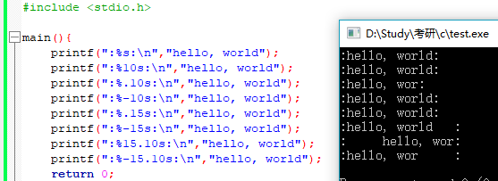
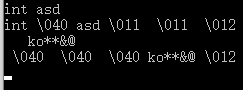

# Ch7 输入与输出

### 7.1标准输入/输出

#### 7-1 根据程序自身被调用时存放在argv[0]中的名字，实现将大写字母转换为小写字母或将小写字母转换为大写字母的功能

~~~c
// 根据程序自身被调用时存放在argv[0]中的名字，
// 实现将大写字母转换为小写字母或将小写字母转换为大写字母的功能
#include <stdio.h>
#include <ctype.h>
#include <string.h>

main(int argc, char *argv[]){
    int c;
    if(strcmp(argv[0], "lower") == 0)
        while((c = getchar()) != EOF)
            putchar(tolower(c));
    else
        while((c = getchar()) != EOF)
            putchar(toupper(c));
    return 0;
}
~~~

### 7.2 格式化输出——printf函数

~~~c
int printf(char *format, arg1, arg2, ...)
~~~

**每个转换说明都是由一个%开始，并以一个转换字符结束**

~~~c
int sprintf(char *string, char *format, arg1, arg2, ...)
~~~

sprintf可将结果放到string中

#### 7-2 *以合理的方式打印任何输入。该程序至少能够根据用户的习惯以八进制或十六进制打印非图形字符，并截断长文本行

~~~c
#include <stdio.h>
#include <ctype.h>
#define MAXLINE 100
#define OCTLEN 6
// 以合理的方式打印任何输入。该程序至少能够根据用户的习惯以八进制或十六进制打印非图形字符，并截断长文本行
main(){
    int c, pos;
    int inc(int pos, int n);

    pos = 0;
    while((c = getchar()) != EOF)
        if(iscntrl(c) || c == ' '){ // iscntrl：寻找非显示字符，删除控制符和普通控制字符，空格										  也被看做一个非显示字符
            pos = inc(pos, OCTLEN); // 非显示字符将打印为长度为OCTLEN个字符的八进制数字
            printf(" \\%03o ", c);
            if(c == '\n'){
                pos = 0;
                putchar('\n');
            }
        }
        else{ // 正常字符
            pos = inc(pos, 1);
            putchar(c);
        }
    return 0;
}

int inc(int pos, int n){
    if(pos + n < MAXLINE)
        return pos+n;
    else{
        putchar('\n');
        return n;
    }
}
~~~

iscntrl：寻找非显示字符，即删除控制符和普通控制字符，空格也被看做一个非显示字符

### 7.3 变长参数表

~~~c
int printf(char *fmt, ...)
~~~

**省略号表示参数表中的参数的数量和类型是可变的，只能出现在参数表的尾部**

~~~c
#include <stdarg.h>

// 带有可变参数表的简化的printf函数
void minprintf(char *fmt, ...){
    va_list ap; // 依次指向每个无名参数
    char *p, *sval;
    int ival;
    double dval;

    va_start(ap, fmt); // 将ap指向第一个无名参数
    for(p=fmt; *p; p++){
        if(*p != '%'){
            putchar(*p);
            continue;
        }
        switch(*++p){
        case 'd':
            ival = va_arg(ap, int); // 返回一个参数，并将ap指向下一个指针
            printf("%d", ival);
            break;
        case 'f':
            dval = va_arg(ap, double);
            printf("%f", dval);
            break;
        case 's':
            for(sval=va_arg(ap, char*); *sval; sval++)
                putchar(*sval);
            break;
        default:
            putchar(*p);
            break;
        }
    }
    va_end(ap); // 结束清理
}

int fun(){
    return 0;
}

main(){
    minprintf("%d, %f, %s, %d\n",1, 1.1, "aaaaa", fun());
    return 0;
}
~~~

####7-3 改写minprintf函数，使它能完成printf函数的更多功能

~~~c
#include <stdarg.h>
#include <ctype.h>
#include <stdio.h>
#define LOCALFMT 100

// 带有可变参数表的简化的printf函数
void minprintf(char *fmt, ...){
    va_list ap; // 依次指向每个无名参数
    char *p, *sval;
    char localfmt[LOCALFMT];
    int i, ival;
    double dval;
    unsigned uval;

    va_start(ap, fmt); // 将ap指向第一个无名参数
    for(p=fmt; *p; p++){
        if(*p != '%'){
            putchar(*p);
            continue;
        }
        i = 0;
        localfmt[i++] = '%';
        while(*(p+1) && !isalpha(*(p+1))) // 为处理转换说明做准备，即处理格式参数
            localfmt[i++] = *++p;
        localfmt[i++] = *(p+1);
        localfmt[i] = '\0';
        switch(*++p){
        case 'd':
        case 'i':
            ival = va_arg(ap, int); // 返回一个参数，并将ap指向下一个指针
            printf(localfmt, ival);
            break;
        case 'f':
            dval = va_arg(ap, double);
            printf(localfmt, dval);
            break;
        case 's':
            sval = va_arg(ap, char*);
            printf(localfmt, sval);
            break;
        case 'x':
        case 'X':
        case 'u':
        case 'o':
            uval = va_arg(ap, unsigned);
            printf(localfmt, uval);
            break;
        default:
            putchar(localfmt);
            break;
        }
    }
    va_end(ap); // 结束清理
}

int fun(){
    return 0;
}

main(){
    minprintf("%-5d, %f, %s, %d\n",1, 1.1, "aaaaa", fun());
    return 0;
}
~~~

### 7.4 格式化输入——scanf函数

从标准输入中读取字符序列，按照format中的格式说明对字符序列进行解释，并把结果保存到其余的参数中，且其余的参数必须是指针，用于指定经格式转换后的相应输入保存的位置

~~~c
int sscanf(char *string, char *format, arg1, arg2...)
// 按照格式参数format中规定的格式扫描字符串string并把结果分别保存到arg1、arg2...这些参数中
~~~

~~~c
#include <stdio.h>

main(){
    double sum, v;

    sum = 0;
    while(scanf("%lf", &v) == 1)
        printf("\t%.2f\n", sum += v);
    return 0;
}
~~~

可读取mm/dd/yy格式的数据

~~~c
int day, month, year;
scanf("%d/%d/%d", &month, &day, &year);
~~~

